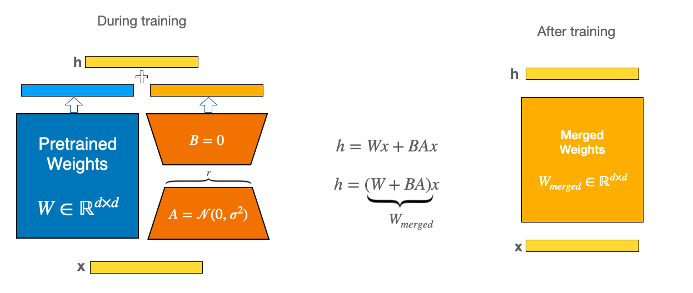

This works because during training, the smaller weight matrices (A and B in the diagram below) are separate. But once training is complete, the weights can actually be merged into a new weight matrix that is identical.

<p align="center">
     
    <em>LoRA Merge Weights</em>
</p>

### How To Merge LoRA Weights
Here we talk about Deepspeed + Lightning model merge.

1. Merge Deepspeed model into single shard
```python
module_spec = importlib.util.spec_from_file_location("zero_to_fp32", os.path.join(ckpt_path_dir, "zero_to_fp32.py"))
zero_to_fp32 = importlib.util.module_from_spec(spec)
spec.loader.exec_module(zero_to_fp32)
zero_to_fp32.convert_zero_checkpoint_to_fp32_state_dict(ckpt_path_dir, single_shard_output_ckpt_path)
``` 

2. Load Base model
Load base model (the model before lora fine-tuning)
```python
base_model = AutoModelForCausalLM.from_pretrained(base_model_name_or_path, torch_dtype="auto")
``` 

3. Get peft model
```python
peft_config = LoraConfig(**json.load(open(args.peft_config)))
# This model has both base and adapter model definition, weights are not initialized
peft_model = get_peft_model(base_model, peft_config)s
```

4. Load LoRA fine-tuned ckpt
Load LoRA fine-tuned checkpoint and replace lightning prefix (`_forward_module`) with peft model prefix (`base_model`). Fix other parameter issues (like model head etc), then put the state_dict into the peft_model from above step.

5. Merge
```python
merged_model = peft_model.merge_and_unload()
merged_model.save_pretrained(model_save_path)
```

