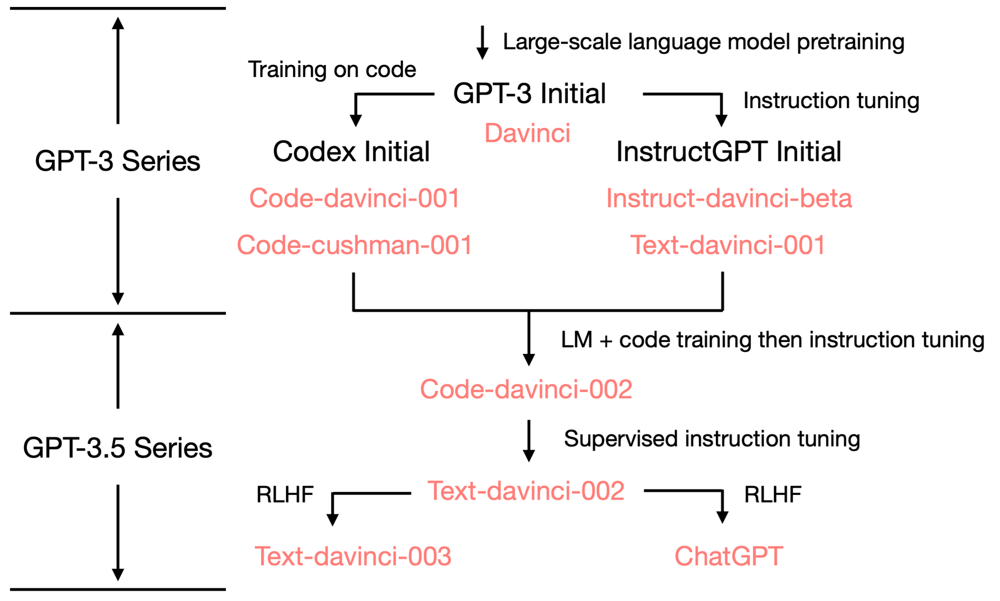

Large language model pretraining is a very challenging task which requires very strong engineering and science skills. People tend to underestimate efforts needed to train a good large model like GPT3 etc. Most people imagine that they can get decent language models given enough computation resources. The fact is even today only OpenAI is providing LM APIs where people can freely play with and get good performances. In this blog, we'll talk about pretraining from the whole pipeline: data sourcing, collection and processing, tokenization, architecture engineering and evaluation. Hopefully, it would be helpful for foundational model training practitioners. 

### Data
Data is crucial in any ML system. This is true to pretraining as well. As is shown in Gopher paper,  a large, diverse and high-quality dataset is needed to train a good model. In the following table, it shows the datasets used in [`Gopher` model](https://arxiv.org/pdf/2112.11446.pdf) training. Now we're looking at terabytes scale of training data. 

    
     
    <em>Datasets used in Gopher [2]</em>
     

An ensuing problem with large amount of data is that data quality is hard to control. In practice, we have to at least make sure the content should be intelligible. We might want to give more training on high-quality datasets such as books and wikipedia [31]. Diversified datasets are necessary but can't guarantee training success as can be seen from `Gopher` paper, model performs well on QA related tasks but suffers on reasoning task. What else is needed? We'll come back to this later. 

#### Toxicity Filter
There is experiment shows that toxicity filter could have a big impact on model performance. In [37], the authors proposed that instead of using a toxicity filter, inverse toxicity filtering is more helpful. Inverse toxicity filter removes the LEAST toxicity data from training data. 

### Tokenizer
Language models compute probability of any string sequence. How to represent the string sequence is determined by tokenizer. Popular options are byte pair encoding (BPE) or wordpiece. As the majority of models are using BPE today, here we focus on BPE based tokenizer. Tokenizer can impact several things in LLM training: (1) a high compression rate (tokenized token number vs raw token number, the lower the better). Compression rate affects input context length and inference speed. (2) Vocab size. An appropriately sized vocabulary to ensure adequate training of each word embedding.

As mentioned in GPT2 paper, BPE effectively interpolates between word level inputs for frequent symbol sequences and character level inputs for infrequent symbol sequences. Directly using greedy method to build BPE merging rules can be problematic. For example, word `cat` can be used in a lot of places like `cat?`, `cat!`, `cat.`. One way to solve this issue is to prevent BPE from generating rules across different character categories (letters, digits, puncts etc).

As people are pivoting in-context learning/instruction learning with large models, tokenization efficiency becomes more important. The following tables from Jurassic-1 paper shows the efficiency of tokenizer on several public dataset. 

    
    <em>Tokenizer efficiency comparison from [16]</em>
     

Tokenizer determines the size of vocab. Usually when we support multilinguality and code data, the vocab size will be much larger. However, this is not always the case. CodeLLaMa shows very good performance (onpar with GPT4) with a vocab size of 32k. When vocab is too large, some of the tokens may not be trained enough. When vocab size is too small, the compression rate might be limited. 

Compression rate determines the input sequence length to the model. With high compression rate, the input length is shorter. Short sequence length might be able to mitigate exposure bias to some extent.

Open tokenizer implementations are: [tiktoken](https://github.com/openai/tiktoken). 

### Model Architecture
All pretrained models are variant of original transformer model. The differences are mainly about it's encoder-decoder architecture or decoder-only architecture. First of all, let's take a look at the choices of available large models. 

| Models  | Model Size   | Token Size|  Architecture  | 
--------|------ | ------ | ------ | ------ |
| GPT3 | 175B | 300B | Decoder | 
| OPT | 175B| 300B | Decoder | 
| PaLM | 540B| 780B | Decoder | 
| Gopher | 280B| 300B | Decoder | 
| Chinchilla | 70B| 1400B | Decoder | 
| Jurassic-1 | 178B| - | Decoder | 
| Megatron-Turing NLG | 530B| 270B | Decoder | 
| LaMDA | 137B| 2810B | Decoder | 

Although all models listed here are auto-regressive decoder only model, they actually differ a bit inside the decoder. For instance, to speed up inference time, PaLM is using multi-query attention. Normally, in multi-head attention, there will be h heads each with a linear project layer for Q, K, V. With multiquery attention, instead of using h different linear project layers for K and V, we can share a single smaller linear project layer for K and a single linear projection layer for V for each head. Then, for different head layers, K and V will be the same. In this way, we can save memory IO and get better latency performance in incremental inference. To speed up training, people also proposed parallel layer architecture as shown below.

     
    <em>Model Architecture</em>
     

A systematic study of transformer architecture is done in Ref [29]. Most of recent LLM architecture are following design from this paper. 

People usually call the embedding dim as the width of transformer and number of layers as the depth. There is a optimal depth-to-width
allocation for a given self-attention network size as is shown in [34].

### Training Design
Most of today's pretraining follow suits of a multi-stage and multi-task training. As is shown by Yao in [1], GPT series model is pretrained in such way as well. 

     
     
    <em>GPT Model Lineage. Image from [1]</em>
     

From the lineage diagram, we can see that `ChatGPT` model comes from `Codex` model which can be seen as a different stage of training. The way of scheduling tasks and data during training can have great impact on the final model performance. 

#### Batch Size
Research [5] shows that there is a critical batch size in pretraining. When training batch size exceeds critical batch size, model performance starts to degrade. Critical batch size is independent of model size and is related to loss. 

Generally small batch size leads to better validation loss when training with the same number of tokens as more random movement of gradient explores more of loss landscape. Often times, small batch size gives better generalization performance as well as pointed out in [27]. The reason given from the paper is that smaller batch size usually converges to flat minimum as oppose to sharp minimum. Intuitively, this is related to graident update in each step is small for large batch size training. 

     
     
    <em>Flat and Sharp Minima [27]</em>
     

#### Learning Rate Scheduling
Usually as pointed out in [20], when we scale up batch size, we increase learning rate propotionally. However, when we increase model size (usually followed with batch size increase), the training tends to be more unstable. Thus, in reality, we decrease maximum learning rate when we increase model size (batch size).

Learning rate scheduling usually involves a (linear) warm-up step to maximum learning rate and followed by a decaying step to 0 or a minimum learning rate. Currently, there are several methods in literature for the decaying step:
- Linear scheduler
- Plateau-linear schedule 
- Cosine scheduler

#### Regularization
One of the most used regularization method is L2 regularization, aka, weight decay [28]. For instance, GPT 3 training uses a weight decay of 0.1. Note that comparing with traditional neural network tuning weight decay number (such as 0.01) GPT3 weight decay is pretty large. 

#### Length Extrapolation
As in-context learning becomes popular, people are asking a question, Can an LLM maintain equally good, if not better, perplexities when longer sequences are used during inference time? This is the so-called length extrapolation [25].  

#### Optimizer
When we select an optimizer, we have to take consideration of memory footprint and stability issues etc. Options are **Adafactor**, **Adam** etc. According to **Gopher** paper, adafactor optimizer has smaller memory footprint, and on smaller scale model (<7B) adafactor works well. However, when model size goes larger, performance suffers because of stability issue. 

### Evaluation
A lot of large models come out every year and many claims that they could beat GPT3 model in a wide range of benchmarks like `SuperGlue`, `CLUE`, `MMLU` etc. However, when you do benchmark these models in zero-shot setting or some less common tasks (but still very reasonable ones), these models tend to perform really bad. I personally tested `GPT3` model (175b) and `UL2` model (20b) on text2sql and sql2text task, GPT3 gives way better performance to the extent that you'll believe UL2 is like garbage. The similar thing happened in evaluation in [24]. You may argue that the model size differs a lot. However, we can think the other way around: the results they claim better than GPT3 is also got from a smaller model and maybe their model training is not easy/efficient to scale to such level. Essentially, what I want to say is that good performance on popular benchmark datasets doesn't mean much for large LM pretraining as this is highly related to source of training data, whether or not doing fine-tuning, proper prompting etc. Human evaluation is what really matters. 

### Stability
During the model training, the most commonly seen issue is gradient exploding, aka, gradient becomes `NaN`. As layers go deeper, this problem happens more often because the way backpropagation works. Over the years, people have proposed many different ways to solve the challenge. 
As is shown in paper [21], the post-LN shows stability issue without carefully designed warming-up stage. As a result, they are proposing pre-LN to alleviate the problem. 

The objective function for highly nonlinear deep neural networks often contains sharp nonlinearities in parameter space resulting from the multiplication of several parameters. These nonlinearities give rise to very high derivatives in some places. When the parameters get close to such a cliff region, a gradient descent update can catapult the parameters very far, possibly losing most of the optimization work that had been done [33].

It's important to monitor stability during training. Common practice is to plot activation norm and gradient norm for each step. When these values spike, we know there is something wrong. It's better than looking at loss curve only as loss explosion generally lags behind these two indicators. For instance, when there is bad data, we could have better gauge of when that happens and restart training from that point.

Adept AI has a lengthy [blog post](https://www.adept.ai/blog/sherlock-sdc) talking about hardware error induced stability issue. The blog mentioned two ways to identify erroneous node(s):
- Grid search: partition nodes into groups and train model on each group in a deterministic way. Find the one that has different training loss curve. 
- Parameter checksum check: for each data parallel run, check parameter checksum to see if they are the same to determine which stage might be wrong.

PaLM paper proposed adding z-loss to increase the stability of training. The method is to encourage the logits to stay close to zero. For example, we could add a max-z loss to normalize the logits:
$$
L_{max\\_z} = 2e^{-4} * z^2
$$
where $z$ is the maximum logit value [39]. 

### Efficient Inference
Inference speed determines product cost. Over the years, people have proposed various ways to improve inference speed. The multiquery attention mentioned above is one of these approaches. 
 

## References
[1] [How does GPT Obtain its Ability? Tracing Emergent Abilities of Language Models to their Sources](https://yaofu.notion.site/How-does-GPT-Obtain-its-Ability-Tracing-Emergent-Abilities-of-Language-Models-to-their-Sources-b9a57ac0fcf74f30a1ab9e3e36fa1dc1)  
[2] [Gopher: Scaling Language Models: Methods, Analysis & Insights from Training Gopher](https://arxiv.org/pdf/2112.11446.pdf)  
[3] [UL2: Unifying Language Learning Paradigms](https://arxiv.org/pdf/2205.05131.pdf)  
[4] [Bloom: Estimating the Carbon Footprint of BLOOM, a 176B Parameter Language Model](https://arxiv.org/abs/2211.02001)  
[5] [Scaling Laws for Neural Language Models](https://arxiv.org/abs/2001.08361)  
[6] [GPT: Improving Language Understanding by Generative Pre-Training](https://s3-us-west-2.amazonaws.com/openai-assets/research-covers/language-unsupervised/language_understanding_paper.pdf)  
[7] [GPT2: Language Models are Unsupervised Multitask Learners](https://d4mucfpksywv.cloudfront.net/better-language-models/language_models_are_unsupervised_multitask_learners.pdf)  
[8] [GPT3: Language Models are Few-Shot Learners](https://arxiv.org/abs/2005.14165)  
[9] [InstructGPT: Training language models to follow instructions with human feedback](https://arxiv.org/abs/2203.02155)  
[10] [WebGPT: Browser-assisted question-answering with human feedback](https://arxiv.org/abs/2112.09332)  
[11] [OPT: Open Pre-trained Transformer Language Models](https://arxiv.org/abs/2205.01068)  
[12] [OPT2: OPT-IML Scaling Language Model Instruction Meta Learning through the Lens of Generalization](https://github.com/facebookresearch/metaseq/tree/main/projects/OPT-IML)  
[13] [PaLM: Scaling Language Modeling with Pathways](https://arxiv.org/abs/2204.02311)  
[14] [Flan-PaLM: Scaling Instruction-Finetuned Language Models](https://arxiv.org/pdf/2210.11416.pdf)  
[15] [Chinchilla: Training Compute-Optimal Large Language Models](https://arxiv.org/abs/2203.15556)  
[16] [Jurassic-1: Technical details and evaluation.](https://uploads-ssl.webflow.com/60fd4503684b466578c0d307/61138924626a6981ee09caf6_jurassic_tech_paper.pdf)  
[17] [Megatron-NLG: Using DeepSpeed and Megatron to Train Megatron-Turing NLG 530B, A Large-Scale Generative Language Model](https://arxiv.org/abs/2201.11990)  
[18] [LaMDA: Language Models for Dialog Applications](https://arxiv.org/pdf/2201.08239.pdf)  
[19] [Codex: Evaluating Large Language Models Trained on Code](https://arxiv.org/abs/2107.03374)  
[20] [Accurate, Large Minibatch SGD: Training ImageNet in 1 Hour](https://arxiv.org/abs/1706.02677)   
[21] [On Layer Normalization in the Transformer Architecture](https://arxiv.org/abs/2002.04745)  
[22] [GLM-130B: An Open Bilingual Pre-trained Model](https://arxiv.org/abs/2210.02414)  
[23] [T0: Multitask Prompted Training Enables Zero-Shot Task Generalization](https://arxiv.org/abs/2110.08207)  
[24] https://zhuanlan.zhihu.com/p/590240010  
[25] [RoFormer: Enhanced Transformer with Rotary Position Embedding](https://arxiv.org/abs/2104.09864)  
[26] [Receptive Field Alignment Enables Transformer Length Extrapolation](https://arxiv.org/abs/2212.10356)  
[27] [On Large-Batch Training for Deep Learning: Generalization Gap and Sharp Minima](https://arxiv.org/abs/1609.04836)  
[28] [Decoupled Weight Decay Regularization](https://arxiv.org/pdf/1711.05101.pdf)  
[29] [Do Transformer Modifications Transfer Across Implementations and Applications?](https://arxiv.org/abs/2102.11972)  
[30] [xFormers: A modular and hackable Transformer modelling library](https://github.com/facebookresearch/xformers)  
[31] [LLaMA: Open and Efficient Foundation Language Models](https://scontent-sea1-1.xx.fbcdn.net/v/t39.8562-6/333078981_693988129081760_4712707815225756708_n.pdf?_nc_cat=108&ccb=1-7&_nc_sid=ad8a9d&_nc_ohc=4srK2r5szdYAX8pFEBs&_nc_ht=scontent-sea1-1.xx&oh=00_AfBU6VS0w7YtW_0wD4YO2NbJg-fXXaFGrRh6jEr8Z73xDg&oe=6407B8A2)  
[32] [What Language Model to Train if You Have One Million GPU Hours?](https://arxiv.org/abs/2210.15424)  
[33] [On the difficulty of training Recurrent Neural Networks](https://arxiv.org/pdf/1211.5063.pdf)  
[34] [Limits to Depth-Efficiencies of Self-Attention](https://papers.nips.cc/paper/2020/file/ff4dfdf5904e920ce52b48c1cef97829-Paper.pdf)  
[35] [Baichuan LLM](https://cdn.baichuan-ai.com/paper/Baichuan2-technical-report.pdf)  
[36] [Qwen LLM](https://github.com/QwenLM/Qwen-7B/blob/main/tech_memo.md)  
[37] [A Pretrainer's Guide to Training Data: Measuring the Effects of Data Age, Domain Coverage, Quality, & Toxicity](https://arxiv.org/abs/2305.13169)  
[38] [GLaM: Efficient Scaling of Language Models with Mixture-of-Experts](https://arxiv.org/pdf/2112.06905.pdf)  
[39] [Baichuan 2: Open Large-scale Language Models](https://arxiv.org/pdf/2309.10305.pdf)  
[40] [The Falcon Series of Open Language Models](https://arxiv.org/abs/2311.16867)  
[41] [Simplifying Transformer Blocks](https://arxiv.org/abs/2311.01906)  
[42] [What Language Model Architecture and Pretraining Objective Work Best for Zero-Shot Generalization?](https://arxiv.org/abs/2204.05832)  
[43] https://huggingface.co/spaces/nanotron/ultrascale-playbook?section=high_level_overview

