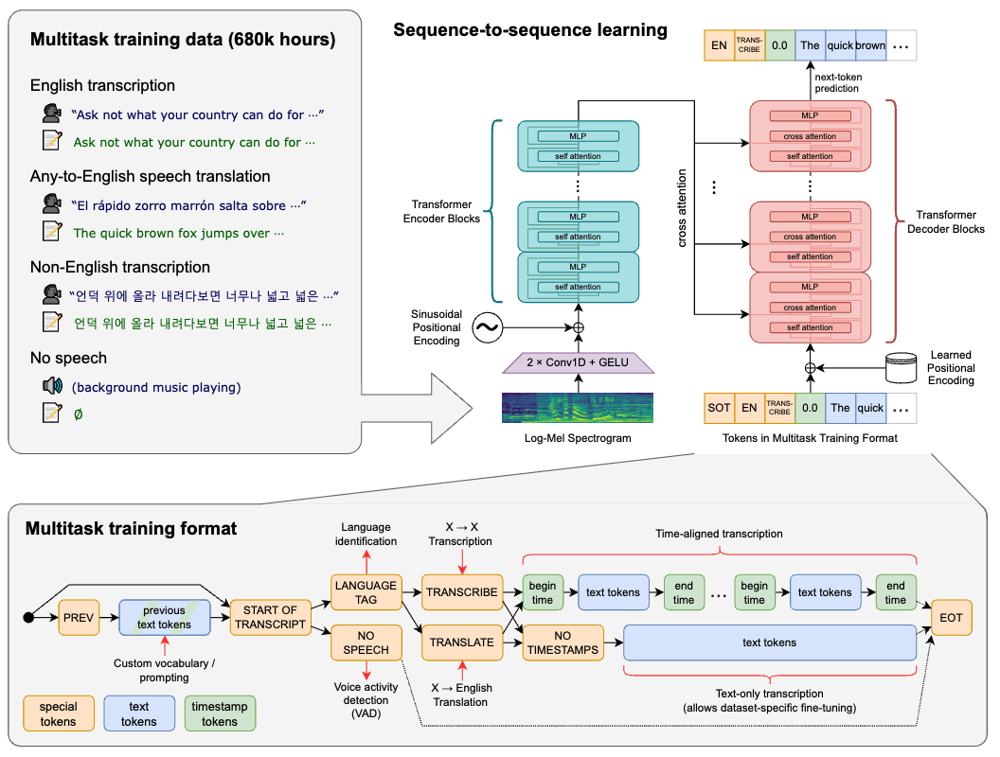

Whisper model is large scale weakly supervised training ASR model from OpenAI. Whisper model encoder is widely used in speech tokenization. 

## Data Processing
1. Construct the dataset from audio that is paired with transcripts on the Internet
2. Filter out machine generated data as other ASR systems generated data can significantly impair the performance of translation systems
3. Audio language detector
4. Break audio files into 30-second segments paired with transcript in the time segment
5. Trained model with segment without speech, but at a reduced data sampling rate
6. De-duplication at a transcript level between train and eval datasets

## Model

The model architecture is encoder-decoder Transformer. Notice that this is different from LLM training where most models are decoder-only model. The reason is for ASR task, the whole audio segment is available before transcribe. 

The data flow is as follows
1. extract fbank features using a window length of 25ms and a stride of 10ms; 
2. pass the fbank features through two convolutional layers (to reduce feature complexity, the second convolution uses a stride of 2 for 2x downsampling) and add positional encoding; 
3. pass them through a standard Transformer encoder to perform self-attention and obtain the audio's encoder hidden state; 
4. decoder's autoregressive decoding

Training takes into consideration of multiple tasks such as transcription, translation, voice activity detection, alignment, and language identification etc.

    

To handle multitask processing, the output is design as a unified generation format. For instance, the output is conditioned on history of text of the transcript (the transcript text preceding the current audio segment). 
Generation includes:
- Language ID
- <|nospeech|> token for no speech segment
- <|transcribe|> or <|translate|> for text generation (next token prediction)

## References
1. Robust Speech Recognition via Large-Scale Weak Supervision

