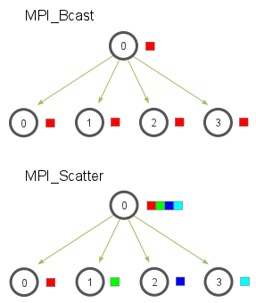
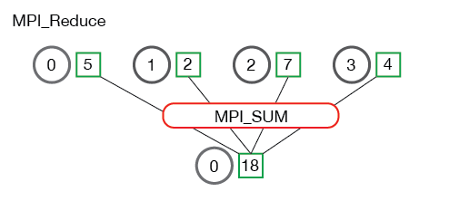

Distributed infrastructure is a big and interesting topic. I don't work on infrastructure side, but I run into the concepts a lot, so I create this blog to help me understand more about infrastructure.

Most of today's distributed framework involves three parts, collective communication, data loading and preprocessing and distributed scheduler. We'll look into these three parts resepectively.

## Collective Communication
We can start with point to point communication. Normally point to point communication refers to two processes communication and it's one to one communication. Accordingly, collective communication refers to 1 to many or many to many communication. In distributed system, there are large amount of communications among the nodes. 

There are some common communication ops, such as Broadcast, Reduce, Allreduce, Scatter, Gather, Allgather etc.  

### Broadcast and Scatter
Broadcast is to distribute data from one node to other nodes. Scatter is to distribute a portion of data to different nodes. 

     
     
    <em>MPI broadcast and scatter</em>
     

### Reduce and Allreduce
Reduce is a collections of ops. Specifically, the operator will process an array from each process and get reduced number of elements.
<!--  -->

     
     
    <em>MPI reduce</em>
     

     
     
    <em>MPI reduce</em>
     

Allreduce means that the reduce operation will be conducted throughout all nodes.

     
     
    <em>MPI Allreduce</em>
     

