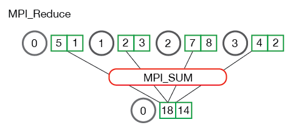

Distributed infrastructure is a big and interesting topic. I don't work on infrastructure side, but I run into the concepts a lot, so I create this blog to help me understand more about infrastructure.

Most of today's distributed framework involves three parts, collective communication, data loading and preprocessing and distributed scheduler. We'll look into these three parts respectively.

## Distributed System Overview
In the diagram below, I'm showing the modern distributed network communication implementation stack, from the bottom hardware to top level application.

     
    <em>Training system architecture</em>
     

## Collective Communication
We can start with point to point communication. Normally point to point communication refers to two processes communication and it's one to one communication. Accordingly, collective communication refers to 1 to many or many to many communication. In distributed system, there are large amount of communications among the nodes. 

There are some common communication ops, such as Broadcast, Reduce, Allreduce, Scatter, Gather, Allgather etc.  

### Broadcast and Scatter
Broadcast is to distribute data from one node to other nodes. Scatter is to distribute a portion of data to different nodes. 

     
    <em>MPI broadcast and scatter</em>
     

### Gather
Gather is an inverse operation of scatter.

     
    <em>MPI gather</em>
     

### Reduce and Allreduce
Reduce is a collections of ops. Specifically, the operator will process an array from each process and get reduced number of elements.
<!--  -->

     
    <em>MPI reduce</em>
     

     
    <em>MPI reduce</em>
     

Allreduce means that the reduce operation will be conducted throughout all nodes. An all_reduce takes in a local array on each machine and returns the sum of all the arrays on every machine. Here we show flat all reduce operation below. However, the most common algorithm for doing this is a variant of the “ring allreduce”,

     
    <em>MPI Allreduce</em>
     

The ReduceScatter operation performs the same operation as Reduce, except that the result is scattered in equal-sized blocks between ranks, each rank getting a chunk of data based on its rank index. In the figure below, each rank provides an array in of N (also called N element buffer, 4 here) values, 

     
    <em>MPI ReduceScatter</em>
     

Note: Executing ReduceScatter, followed by AllGather, is equivalent to the AllReduce operation.

### Mixed Precision Training
Normally, during training we use single precision (32-bit floats). However, for LLM pretraining, this requires high-bandwidth computing platform. To address this challenge, people proposed mixed precision training. As the name suggested, mixed precision training is to leverage mixed different data type during training process, e.g. fp32 and fp16 or fp32 and bf16. We train model mostly in 
half precision and leave some critical ops in fp32. ss

     
     
    <em>Mixed precision training (image from fastai)</em>
     

Since it has same range as FP32, BF16 mixed precision training skips the scaling steps. All other Mixed Precision steps remain the same as FP16 Mixed Precision.
We leave the batchnorm layers in single precision (they don’t have many weights so it’s not a big memory challenge) and compute the loss in single precision (which means converting the last output of the model in single precision before passing it to the loss).
The training loop is as follows:
- compute the output with the FP16 model, then the loss
- back-propagate the gradients in half-precision.
- copy the gradients in FP32 precision
- do the update on the master model (in FP32 precision)
- copy the master model in the FP16 model.

### References
1. https://docs.nvidia.com/deeplearning/nccl/user-guide/docs/usage/collectives.html
