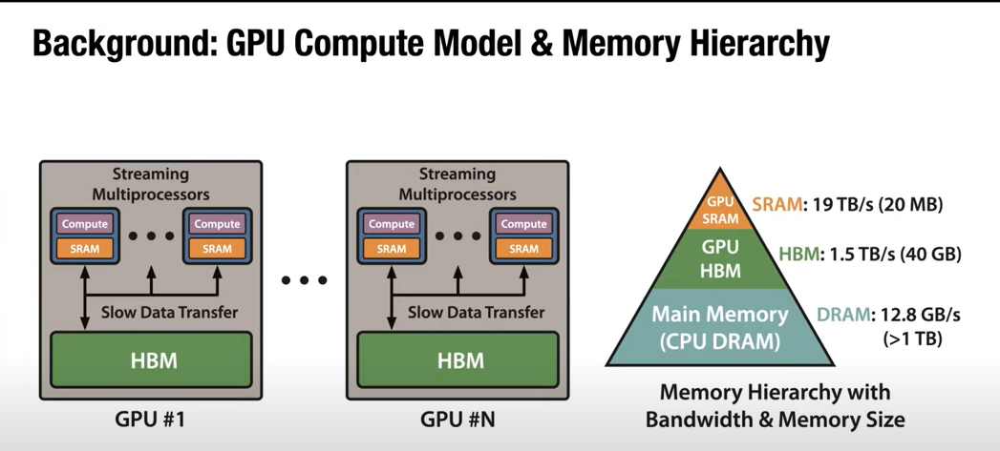

In order to understand how flash attention and its variants help improve compute efficiency of modern LLMs training, we first have to dive deep into GPU compute model and its memory hierarchy. 

## GPU Compute Model and Memory Hierarchy
The Figure 1 here shows the high level compute model and memory in GPU. We can see that there are three types of memory affect GPU computation. CPU memory (data loading etc), GPU high bandwidth memory (the gpu memory we usually mentioned), and GPU caches (SRAM). These memories are of different size and bandwidth (read speed). Figure 2 shows the hierarcy of GPU memory in A100. 

     
     
    <em>GPU memory</em>
     

     
     
    <em>GPU memory hierarchy</em>
     

For each computation, there are three steps of operation
- Read op — Move tensor from HBM to SRAM
- Compute op - Perform compute intensive task on SRAM
- write op - move tensor back from SRAM to HBM