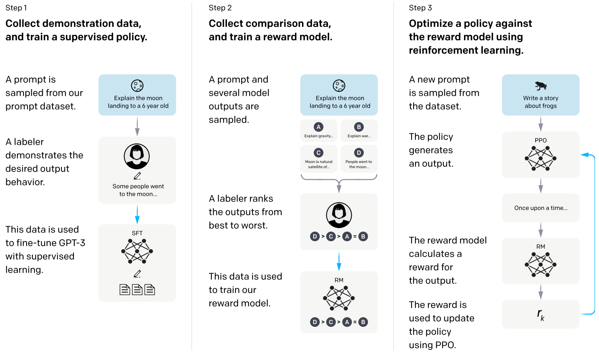
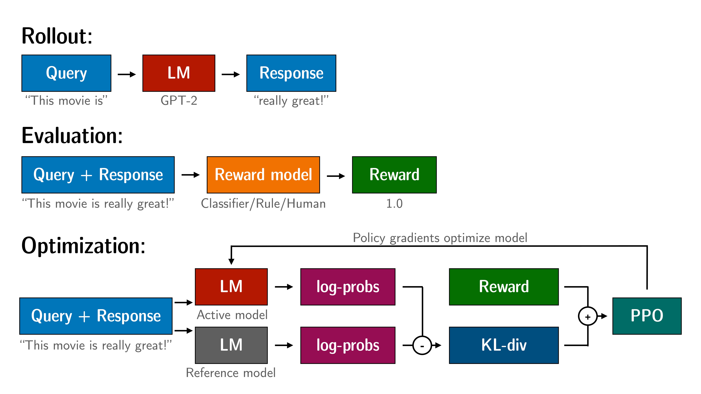

Recently ChatGPT model has demonstrated remarkable success of large pretrained language model being able to generate coherent, logical and meaningful conversations. While as of this writing, the corresponding paper is still not available yet. In this blog, I'll dive deep into InstructGPT model to see what's under the hood of this model. 
### Issues with Traditional LM
Language modeling objective is trying to predict next token given all previous tokens. However, when we're prompting LM in inference time, we hope LM can generate things based on our instructions/intent instead of merely predicting the most likely tokens. This is the so-called `misalignment` between training and inference. 

### Solution
Using reinforcement learning to learn human feedback. For this purpose, they have to collect a dataset. The way to collect the dataset is as follows: 
- select some contract labeler
- collect human written prompt-answer pairs. Prompts are either from GPT3 API or from human annotation.
- collect a dataset of human-labeled comparisons between outputs from our models on a larger set of API prompts.

The following diagram from the paper demonstrated how these steps unfold during the training. 

    
     

In summary, there are three steps: 
- Use labeled data to fine-tune GPT3 model
- Train a reward model
- Use RL to optimize GPT3 parameters

In the first step, we got data from annotators and use this data to fine-tune GPT3 model. In the second step, they prepare some questions and GPT3 model gives multiple predictions for each question and annotators are asked to rank the generated predictions. This data is used to train reward model. The reward model is used for prediction and predict which one is most close to human choice. Reward model gives a score and the closer to human choice, the higher of the score. 

Finally, use policy-based RM algorithm to do further optimization. The whole process is shown in the diagram below. It uses reward mechanism to train model. The reward can be seen as the loss function in traditional ML training. Reward function is much more versatile than loss function (Think about DotaRL and AlphaGo). The consequence is that reward function may not be differentiable, thus can't be used for back-propagation. People can sample rewards to proximate this loss function.

    
     
    <em>RL algorithm. Image from [4]</em>
     

### PPO 

From the repo in [4], the three steps of PPO are as follows:

- Rollout: The language model generates a response or continuation based on query which could be the start of a sentence.
- Evaluation: The query and response are evaluated with a function, model, human feedback or some combination of them. The important thing is that this process should yield a scalar value for each query/response pair.
- Optimization: In the optimisation step the query/response pairs are used to calculate the log-probabilities of the tokens in the sequences. This is done with the model that is trained and and a reference model, which is usually the pre-trained model before fine-tuning. The KL-divergence between the two outputs is used as an additional reward signal to make sure the generated responses don't deviate to far from the reference language model. The active language model is then trained with PPO.

(To be continued)

### References
[1] [Learning to summarize from human feedback](https://arxiv.org/pdf/2009.01325.pdf)  
[2] [InstructGPT: Training language models to follow instructions with human feedback](https://arxiv.org/abs/2203.02155)  
[3] [Fine-Tuning Language Models from Human Preferences](https://arxiv.org/pdf/1909.08593.pdf)  
[4] https://github.com/lvwerra/trl   
[5] https://zhuanlan.zhihu.com/p/590311003   
[6] [Super-natural instructions: generalization via declarative instructions on 1600+ NLP tasks](https://arxiv.org/abs/2204.07705)   
[7] [Training a Helpful and Harmless Assistant with Reinforcement Learning from Human Feedback](https://arxiv.org/abs/2204.05862)

