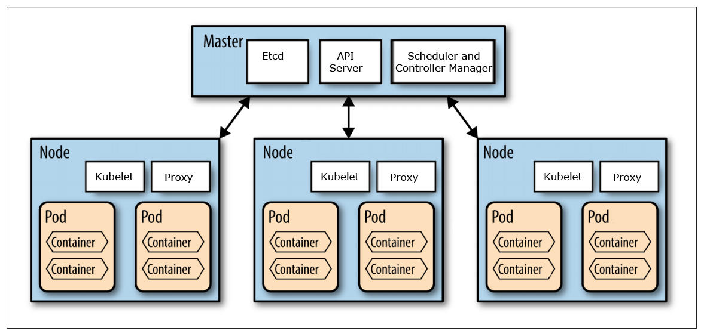

### Basics

Kubernetes, also known as “k8s”, is an open source platform solution provided by Google for scheduling and automating the deployment, management, and scaling of containerized applications. Kubernetes has the ability of scheduling and running application containers on a cluster of physical or virtual machines. In managing the applications, the concepts of 'labels' and 'pods' are used to group the containers which make up an application. Currently, it supports Docker for containers.

<p align="center">
    
    <br>
    <em>kubernetes architecture, image from [1]</em>
    <br>
</p>


Pod is a type of abstraction on top of container. Deployment defines the pod. Deployment is used for stateless apps and StatefulSet is used for stateful apps or database. KubeCTL talks with API server to create components or delete components, in other words configuring the cluster. More about this basics is [here](https://www.youtube.com/watch?v=X48VuDVv0do&t=2749s)

### Basic Operations
To find out all the pods, using the following command
```bash
kubectl get pods 
kubectl get pods | grep username 
kubectl get pods -n my_namespace_name  # get pod understand a 

# get all the nodes
kubectl get nodes

# get services
kubectl get services

# create deployment. (blueprint of pod)
kubectl create deployment my_pod_name --image=my_image
kubectl get deployment
```

To get all the containers running the pod, using the following command
```bash
kubectl get pods my_pod_name -o custom-columns='NAME:.metadata.name,CONTAINERS:.spec.containers[*].name'
kubectl describe pod my_pod_name  -n my_namespace_name
# To get ip. The ip can be used to launch distributed runs.
kubectl get pod my_pod_name --template '{{.status.podIP}}'
```

View logs of job running in the pod
```bash
kubectl logs my_pod_name
kubectl logs -f my_pod_name # similar to attach
kubectl attach my_pod_name  # works with tqdm 
```

Log into the pod
```bash
kubectl exec -it my_pod_name -- /bin/bash
```


We can use `kubectl` to copy files to/from the pod. Be careful that your container may not support `~` this kind of path expansion.
```bash
kubectl cp src_file_path pod:dest_file_path
```

To use rsync is not that straightforward, I'm using the tool from [here](https://serverfault.com/questions/741670/rsync-files-to-a-kubernetes-pod).
```bash
# save the file as krsync, and put it to /usr/bin, and chmod +x to the file

#!/bin/bash

if [ -z "$KRSYNC_STARTED" ]; then
    export KRSYNC_STARTED=true
    exec rsync --blocking-io --rsh "$0" $@
fi

# Running as --rsh
namespace=''
pod=$1
shift

# If use uses pod@namespace rsync passes as: {us} -l pod namespace ...
if [ "X$pod" = "X-l" ]; then
    pod=$1
    shift
    namespace="-n $1"
    shift
fi

exec kubectl $namespace exec -i $pod -- "$@"
```

Then use the following command to sync files. Note that you have to install `rsync` on the pod. 
```bash
krsync -av --progress --stats src-dir/ pod:/dest-dir

# with namespace
krsync -av --progress --stats src-dir/ pod@namespace:/dest-dir

```
To make it easier to use, we can add the following to the .zshrc file
```bash
function krsync_watch_and_sync_to {
        fswatch -o . | xargs -n1 -I{} krsync -av --progress --stats *(D)  $1
}
```

Sometimes we have to change file ownership. Check out more [here](https://vhs.codeberg.page/post/recover-files-kubernetes-persistent-volume/)

```bash
chown -R 33:33 /data/uploads
```

When we want to log into multiple pods, we can use the following command:
```shell
xpanes -c "kubectl exec -p {}" $(kubectl get pods | grep my_pod_prefixes | cut -d" " -f1 | tr '\n' ' ')
```


## References
[1] [Setting up a Kubernetes cluster using Docker in Docker](https://callistaenterprise.se/blogg/teknik/2017/12/20/kubernetes-on-docker-in-docker/) <br>
[2] https://kubernetes.io/docs/reference/kubectl/cheatsheet/ <br>

