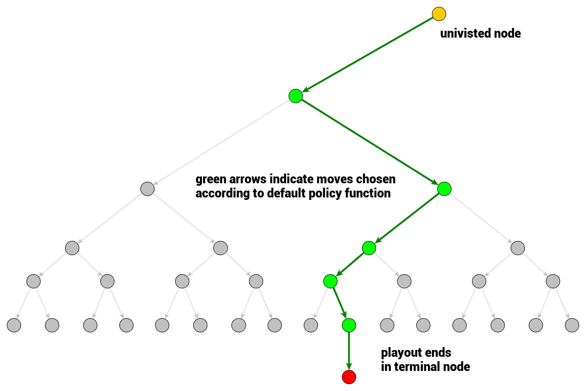

In this blog, we talk about Monte Carlo Tree Search, the algorithm behind very popular AlphaZero. 

### Duel Process
Human cognition has a duel process model which suggests that human reason has two modes. System 1 is a fast, unconscious and automatic mode of thought,like intuition. System 2 is a slow, conscious, explicit and rule-based mode of reasoning. 

Comparing with how LLM works, we can think about that token-level generation is like System 1 mode, and agent planning, lookahead and backtracks is the System 2 mode. 

### MCTS 

The main concept of MCTS is a search. Search is tree traversals of the game tree. Single traversal is a path from a root node (current game state) to a node that is not fully expanded. Node being not-fully expanded means at least one of its children is unvisited, not explored. Once not fully expanded node is encountered, one of its unvisited children is chosen to become a root node for a single playout/simulation. The result of the simulation is then propagated back up to the current tree root updating game tree nodes statistics. Once the search (constrained by time or computational power) terminates, the move is chosen based on the gathered statistics. Thus, the algorithm of the tree traversal in MCTS follows the following steps:

1. Selection: select an unvisited node based on tree policy
2. Expansion: whether to expand a node or skip it if it's visited
3. Simulation/Evaluation: a full play starts in current node (representing game state) and ends in a terminal node where game result can be computed. One simulation expansion is shown below. 
4. Backpropagation: Backpropagate result to all nodes in the traversal chain up to the current game tree root node. 

     
    Figure 1. Simulation in MCTS, image from Ref 3

### Modeling 

To keep record of the game tree traversal simulation results, we have to define a few concepts:

 – $Q(v)$ is total simulation reward is an attribute of a node $v$
 and in a simplest form is a sum of simulation results that passed through considered node.

 – $N(v)$ is total number of visits. It's another atribute of a node $v$ 
 representing a counter of how many times a node has been on the backpropagation path (and so how many times it contributed to the total simulation reward)

 

### References
1. [Thinking Fast and Slow with Deep Learning and Tree Search](https://arxiv.org/abs/1705.08439)
2. [Mastering Chess and Shogi by Self-Play with a General Reinforcement Learning Algorithm](https://arxiv.org/abs/1712.01815)
3. https://int8.io/monte-carlo-tree-search-beginners-guide

<!-- ### Implementation
1. https://github.com/trotsky1997/MathBlackBox
2. https://github.com/BrendanGraham14/mcts-llm -->
