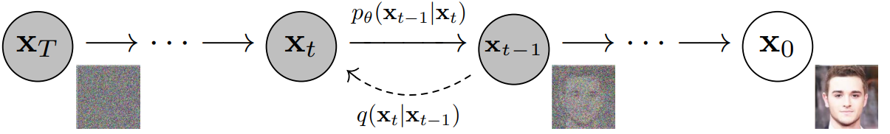

Diffusion is the process where we gradually convert a know distribution into a target distribution and the corresponding reverse process. Fortunately, people have proved that for gaussian distributions, we can convert data to noise and noise to data using the same functional form. 

     
    <em>Figure 1. diffusion process</em>
     

## Forward Process
As is shown in the figure above, there are two processes in diffusion:
- Forward diffusion process: we slowly and iteratively add noise to the images
- Reverse diffusion process: we iteratively perform the denoising in small steps starting from a noisy image to convert it back to original form.

In the forward process (diffusion process), in each step, gaussian noise is added according to a variance schedule $ \beta_1, \dotsb, \beta_T $
$$
q_\theta(x_t|x_{t-1}) = \mathcal{N}(x_t; \sqrt{(1-\beta_t)}x_{t-1}, \beta_t\mathbf{I})
$$
And it's a Markov chain process, so
$$
q_\theta(x_{1:T}|x_0) = \prod_{t=1}^{T}q(x_t|x_{t-1})
$$
However, in implementation the above formulation has a problem because doing sequential sampling will result in inefficient forward process. The authors defined the following items:
$$
\alpha_t = 1 - \beta_t \\\
\bar{\alpha} = \prod_{s=1}^t\alpha_s
$$
Then we have
$$
q_\theta(x_t|x_0) = \mathcal{N}(x_t; \sqrt{\bar{\alpha}}x_0, (1 - \bar{\alpha_t})\mathbf{I})
$$
This process is called reparameterization. This allows us to directly sample $x_t$ from $x_0$ using a single sample of Gaussian noise:

$$
x_t = \sqrt{\bar{\alpha_{t}}}x_0 + \sqrt{1 - \bar{\alpha_{t}}} \epsilon
$$
Here $\epsilon \sim \mathcal{N}(0, I)$. Even though we know the distribution, we don't know the value the noise. In practice, we use neural network to approximate this noise. 

### Reparameterization
Reparameterization is used on both VAE and diffusion. It's needed because in diffusion, we have a lot of sampling operation and these operations are not differentiable. We use reparameterization to make it differentiable. Concretely, people introduce a random variable $\epsilon$, then we can sample from any gussian $z \sim \mathcal{N}(z; \mu_{\theta}, \sigma^2_{\theta}\mathbf{I}) $ as follows:
$$
z = \mu_{\theta} + \sigma_{\theta}  \odot \epsilon ; \epsilon \sim \mathcal{N}(0, \mathbf{I})
$$

## Reverse Process
Obviously, in reverse process we denoise the data and recover the images we have originally step by step. In the reverse process, we use the image at time $t$ to predict image at $t-1$, it follows the following distribution
$$
p(x_{t-1}|x_{t}) = \mathcal{N}(\frac{1}{\sqrt{\alpha_{t}}}(x_t - \frac{1- \alpha_{t}}{\sqrt{1 - \bar{\alpha_{t}}}} \epsilon); \frac{(1- \alpha_{t})(1 - \bar{\alpha_{t-1}})}{\sqrt{1 - \bar{\alpha_{t}}}})
$$

Everything relates to $\alpha$ is a constant. 

## References
1. [Denoising Diffusion Probabilistic Models](https://arxiv.org/pdf/2006.11239.pdf)  
2. [Understanding Diffusion Models: A Unified Perspective](https://arxiv.org/abs/2208.11970)  
3. [Transfusion: Predict the Next Token and Diffuse Images with One Multi-Modal Model](https://www.arxiv.org/pdf/2408.11039)

