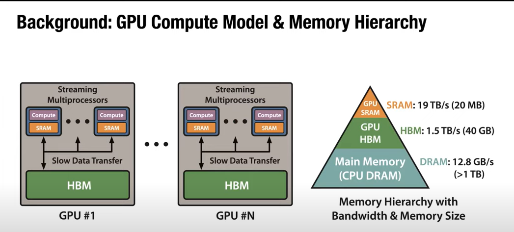
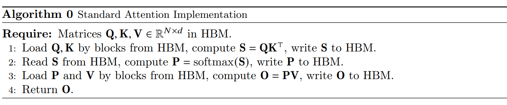
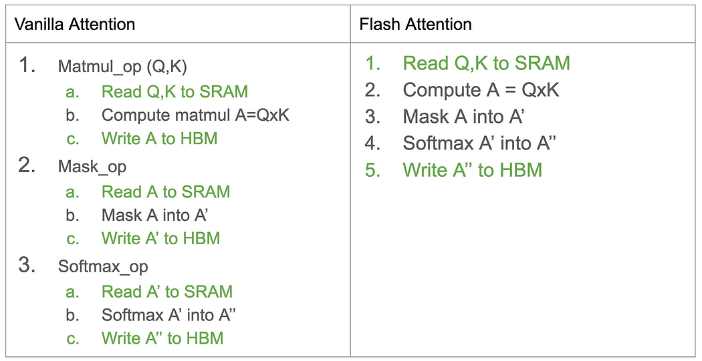
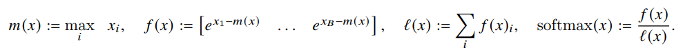
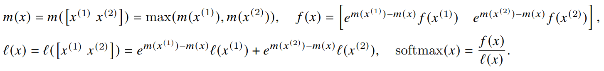

In order to understand how flash attention and its variants help improve compute efficiency of modern LLMs training, we first have to dive deep into GPU compute model and its memory hierarchy. 

## GPU Compute Model and Memory Hierarchy
The Figure 1 here shows the high level compute model and memory in GPU. We can see that there are three types of memory affect GPU computation. CPU memory (data loading etc), GPU high bandwidth memory (the gpu memory we usually mentioned), and GPU caches (SRAM). These memories are of different size and bandwidth (read speed). The idea of flash attention is to design IO-aware fused computation kernel to save memory access to speed up training job.

     
    <em>Figure 1. GPU memory</em>
     

Figure 2 shows a more detailed hierarchy of GPU memory in A100. Notice that cache is specific to each compute unit. 

     
    <em>Figure 2. GPU memory hierarchy</em>
     

<!-- It's very weird that the two is not compatible. THere should be an emtpy line with respect to the html block above, otherwise the inserted image below won't be shown -->
<!-- First let's take a look at the vallina attention computation. *Figure 3. Vallina attention computation* -->

## IO-aware Computation
First let's take a look at the vallina attention computation which is shown below

     
    <em>Figure 3. Vallina attention computation</em>
     

<!-- The same applies here. To make markdown format work, we have to insert an empty line in between. -->
Essentially, each of the operation follows the three steps of operation below.
- Read op — Move tensor from HBM to SRAM
- Compute op - Perform compute intensive task on SRAM
- write op - move tensor back from SRAM to HBM

The breakdown of these computation is as follows. Apparently, all these green ops in the vallina attention can be saved. 

     
    <em>Figure 4. Vallina attention computation break down</em>

However, it's hard to put giant attention matrix of size `[N x N]` in the cache. The idea to solve this challenge is to use tiling. Concretely, we slice the matrices into smaller blocks and in each of **Q** **K** computation, we do it in a small block scale. The output of the small block thus can be saved on the cache. This sounds perfectly except that softmax op is not possible with small block computation. Lucklily there are already some studies dealing with this [1-2]. Before talking about this, let's first revisit stable softmax computation.

## Blockwise Softmax
Underflow in numerical computation can cause precision issue. Overflow can be more problematic because it usually leads to divergence of training job (some may argue silent error is more detrimental :)). Softmax operation involves exponential computation which without careful handling can easily lead to overflow (such as `exp(2000)`).

$$ \text{softmax}(x)_i = \frac{e^{x_i - \max(x)}}{\sum_j e^{x_j - \max(x)}} $$

Similary,  the cross entropy can be computed as 

$$ 
\begin{aligned} 
H(p, q) &= -\sum_i p_i\log(q_i) \\\
&= -1\cdot\log(q_y) -\sum_{i \neq y} 0\cdot\log(q_i) \\\
&= -\log(q_y)  \\\
&= -\log(\text{softmax}(\hat{y})_y) \\\ 
\end{aligned} $$

When $max(x)$ is very large, the numerator could become $0$, and $log$ computation could overflow. To prevent this, we can do one more step:
$$
\begin{aligned}
\log(\text{softmax}(x)_i) &= \log(\frac{e^{x_i - \max(x)}}{\sum_j e^{x_j - \max(x)}}) \\\
&= x_i - \max(x) - \log(\sum_j e^{x_j - \max(x)})
\end{aligned} $$

By simply extracting the max value, we limit the exponential values to be in [0, 1]. In Flashattention paper, the softmax is represented as follows:

     
    <em>Figure 5. Softmax</em>

Then blockwise softmax can be computed as follows:

     
    <em>Figure 6. Blockwise Softmax</em>

With saving some summary (i.e. max, sum of exponentials) statistics, the softmax op can be decomposed into blocks. 

## Blockwise Computation

FlashAttention processes blocks of keys rather than the entire sequence. The challenge is how to compute the denominator $Z_i$ across blocks in a numerically stable way.

The solution uses the log-sum-exp trick and a running maximum.

### The Softmax Denominator

For a single query vector $q_i$, the unnormalized attention scores over all keys $k_j$ are:

$$
s_{i,j} = q_i \cdot k_j.
$$

The softmax weights are:

$$
\alpha_{i,j} = \frac{\exp(s_{i,j})}{\sum_{l=1}^n \exp(s_{i,l})}.
$$

Here, the denominator is:

$$
Z_i = \sum_{l=1}^n \exp(s_{i,l}),
$$

which, naively, requires computing all dot products at once.

### Step 1. Processing One Block

Suppose we process a block of keys $\mathcal{B}$, a block in sequence length dim (time dim). For query $q_i$, we compute scores:

$$
s_{i,j} = q_i \cdot k_j, \quad j \in \mathcal{B}.
$$

Let the maximum score in this block be:

$$
m_i^{(\text{blk})} = \max_{j \in \mathcal{B}} s_{i,j}.
$$

We can then compute a partial exponential sum (shifted for stability):

$$
Z_i^{(\text{blk})} = \sum_{j \in \mathcal{B}} \exp \left(s_{i,j} - m_i^{(\text{blk})}\right)
$$

### Step 2. Merging Across Blocks

Suppose after some blocks, we have:

* A running maximum $m_i^{(\text{old})}$.
* A running denominator accumulator:

$$
Z_i^{(\text{old})} = \sum_{j \in \text{processed blocks}} \exp \left(s_{i,j} - m_i^{(\text{old})}\right).
$$

Now we process a new block. We update the global maximum:

$$
m_i^{(\text{new})} = \max \left(m_i^{(\text{old})}, m_i^{(\text{blk})}\right).
$$

We then rescale the old accumulator to the new maximum:

$$
Z_i^{(\text{new})} = Z_i^{(\text{old})} \cdot \exp \left(m_i^{(\text{old})} - m_i^{(\text{new})}\right) + \sum_{j \in \mathcal{B}} \exp \left(s_{i,j} - m_i^{(\text{new})}\right)
$$

This formula ensures that all contributions are correctly normalized with respect to the same maximum, keeping the computation stable.

### Step 3. Final Normalization

After processing all blocks, we end up with:

* The global maximum $m_i$.
* The final denominator:

$$
Z_i = \sum_{j=1}^n \exp(s_{i,j} - m_i).
$$

Then the attention weights for each block can be computed as:

$$
\alpha_{i,j} = \frac{\exp(s_{i,j} - m_i)}{Z_i}.
$$

### Summary
FlashAttention avoids ever storing the full $n \times n$ matrix by:

1. Computing scores block by block.
2. Keeping track of a running maximum $m_i$.
3. Maintaining a rescaled running sum of exponentials.

This streaming log-sum-exp reduction makes it possible to compute attention in O(n²) time but only O(n) memory, which is a major win for long-sequence transformers.

### Recomputation in Backpropagation
With the fused kernel, we effectively do the computation outside Pytorch computation graph. Thus, we can't use the AutoGrad for gradient computation in backpropagation. Consequently, we have to define the backpropagation by ourselves. The way to solve this is very simple as well. We just define our own backpropagation ops for fused kernel like gradient checkpointing.

### References
[1] [SELF-ATTENTION DOES NOT NEED O(n^2) MEMORY](https://browse.arxiv.org/pdf/2112.05682.pdf)  
[2] [Online normalizer calculation for softmax](https://browse.arxiv.org/pdf/1805.02867.pdf)  
[3] [FlashAttention: Fast and Memory-Efficient Exact Attention with IO-Awareness](https://arxiv.org/abs/2205.14135)
