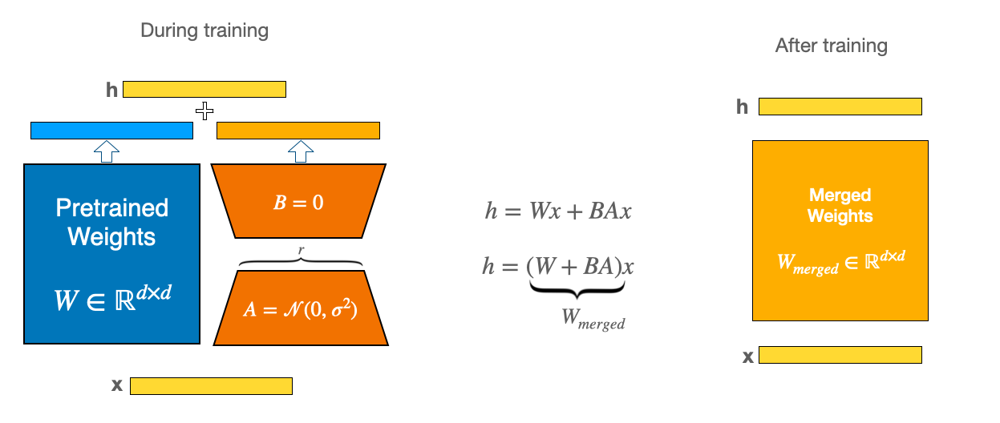

Light-weight LoRA fine-tuning seems to be the go-to option for many application where compute resources are limited. 

### LoRA

The way lora works is illustrated in the figure below. For some matrices in the transformer model, we add a parallel weighted matrix. 
The branch matrix can be decomposed into two smaller matrix. At training time, we only train these small matrices with original weights frozen. 

At inference time, we don't need to maintain separate parameters, thus we merge the LoRA weights into the original model weights.

     
    Figure 1. Lora Fine-tuning and Inference
     

### LoRA Fine-tuning with Deepspeed

Huggingface PEFT package already provides easy-to-use APIs for LoRA fine-tuning. However, when we combine these with Deepspeed, we need to be careful when we merge model weights. 

Below we assume we have Deepspeed checkpoints and we want to have inference model weights with LoRA parameters merged. We have to follow the following steps:
1. Convert Zero checkpoint into a single shard fp32 checkpoint
2. Load the original model before fine-tuning.
3. Get peft config and get peft model using base model and peft config. This kind be done with PEFT API `get_peft_model`
4. Load single shard zero ckpt from step 1 into step3 model definition
5. do **merge_and_unload** and save pretrained model.  

## Reference
1. https://huggingface.co/docs/peft/main/en/conceptual_guides/lora
2. [LoRA: Low-Rank Adaptation of Large Language Models](https://arxiv.org/abs/2106.09685)
