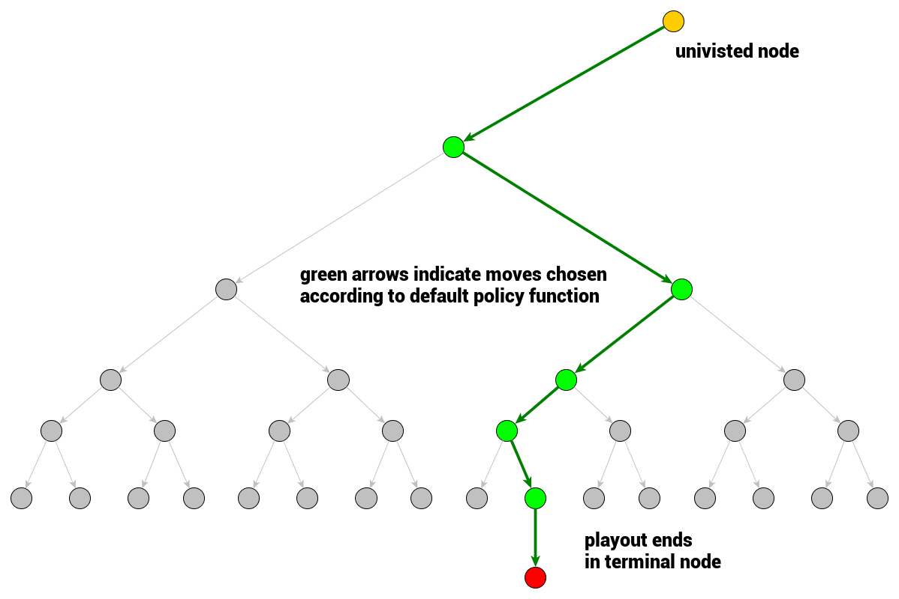
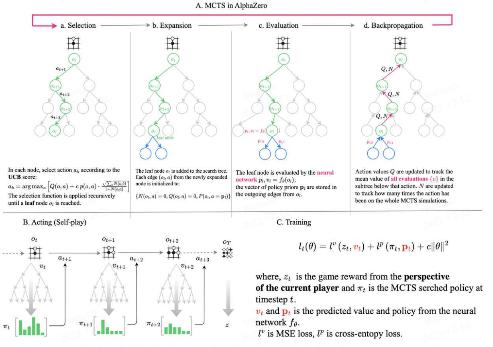

In this blog, we talk about Monte Carlo Tree Search, the algorithm behind very popular AlphaZero. 

### Duel Process
Human cognition has a duel process model which suggests that human reasoning has two modes: System 1 is a fast, unconscious and automatic mode of thought,like intuition. System 2 is a slow, conscious, explicit and rule-based mode of reasoning. 

Comparing with how LLM works, we can think about that token-level generation (greedy decoding) is like System 1 mode, and agent planning, lookahead and backtracks is the System 2 mode. MCTS is the algorithm we can leverage to achieve the system 2 deliberation through exploration, proposing solution and evaluation. 

### MCTS 

The main concept of MCTS is a search. Search is tree traversals of the game tree. Single traversal is a path from a root node (current game state) to a node that is not fully expanded. Node being not-fully expanded means at least one of its children is unvisited, not explored. Once not fully expanded node is encountered, one of its unvisited children is chosen to become a root node for a single playout/simulation. The result of the simulation is then propagated back up to the current tree root updating game tree nodes statistics. Once the search (constrained by time or computational power) terminates, the move is chosen based on the gathered statistics. Thus, the algorithm of the tree traversal in MCTS follows the following steps:

1. Selection: select an unvisited node based on tree policy
2. Expansion: whether to expand a node or skip it if it's visited
3. Simulation/Evaluation: a full play starts in current node (representing game state) and ends in a terminal node where game result can be computed. One simulation expansion is shown below. 
4. Backpropagation: Backpropagate result to all nodes in the traversal chain up to the current game tree root node. 

     
    Figure 1. Simulation in MCTS, image from Ref 3

### Modeling 

From the above process, we can see that there are two key problems that needs to be addressed in MCTS. 
- First is the node selection. How do we select which node to explore. Basically this defines how we explore all action space. 
- Second simulation. How do we get the current traversal evaluated. 

Before answering these question, we first have to keep record of the game tree traversal simulation results. We'll need to maintain a few values for each node:

 – $Q(v)$ is total simulation reward is an attribute of a node $v$
 and in a simplest form is a sum of simulation results that passed through considered node.

 – $N(v)$ is total number of visits. It's another atribute of a node $v$ 
 representing a counter of how many times a node has been on the backpropagation path (and so how many times it contributed to the total simulation reward)

These node statistics reflects the exploitation and exploration in the algorithm. Nodes with high reward are good candidates to follow (exploitation) but those with low amount of visits may be interesting too as they are not explored well. 
 

### Selection

#### UCT
Upper Confidence Bound applied to trees (UCT) is the function used for node selection when traverse the tree. 
For node $v$ with child node $v_i$, we define the UCT function as follows:
$$
UCT(v_i, v) = \frac{Q(v_i)}{N(v_i)} + c \sqrt{\frac{log(N(v))}{N(v_i)}}
$$

where $c$ is a hyperparameter which is used to balance exploitation and exploration. The first part is exploitation component which qualifies the winning rate of a particular child. However, only exploitation component is not enough because it will lead to greedily exploring only those nodes that bring a single winning playout very early at the beginning of the search. 

The second component of UCT called exploration component which favors nodes that have not been explored. 

#### PUCT
Predictor UCT is from Ref 5, it adds a prior to the preference of a particular node. 
$$
PUCT(v_i, v) = \frac{Q(v_i)}{N(v_i)} + c P(v, v_i) \frac{\sqrt{N(v)}}{1 + N(v_i)}
$$

### AlphaZero

Up to now, we only talked about the skeleton of the MCTS algorithm. The following part, we briefly talk about the plug-in part which is the value estimation and policy estimation. 

In AlphaGo, the $Q(v_i)$ function is estimated using the fusion of RL value network and customized fast rollout of supervised training network.
In AlphaZero, the customized fast rollout is removed replaced with a single  19-layer CNN Residual neural network. 

The prior probability of the move (transition from $v$ to $v_i$ ) is estimated through a policy network. 

In AlphaZero, one network is served as both the policy network and value network. The CNN residual neural network has two heads one is used to predict action and the other is to predict value. 

The training of AlphaZero involves three steps:
1. Leveraging MCTS to collect self-play game data
2. Use the data from step 1 to train policy and value networks. The goal of the training is to make policy and value network estimation as close to MCTS result as possible.
3. Use the new models to generate data

     
    Figure 2. AlphaZero

### References
1. [Thinking Fast and Slow with Deep Learning and Tree Search](https://arxiv.org/abs/1705.08439)
2. [Mastering Chess and Shogi by Self-Play with a General Reinforcement Learning Algorithm](https://arxiv.org/abs/1712.01815)
3. https://int8.io/monte-carlo-tree-search-beginners-guide
4. [Bandit based Monte-Carlo Planning](http://ggp.stanford.edu/readings/uct.pdf)
5. Multi-armed bandits with episode context
6. https://github.com/opendilab/LightZero
7. AlphaGo: Mastering the game of Go with deep neural networks and tree search
8. AlphaZero: Mastering the game of go without human knowledge
9. A general reinforcement learning algorithm that masters chess, shogi, and Go through self-play
10. [Monte Carlo Tree Search: A Review of Recent Modifications and Applications](https://arxiv.org/abs/2103.04931)
<!-- ### Implementation
1. https://github.com/trotsky1997/MathBlackBox
2. https://github.com/BrendanGraham14/mcts-llm
3. https://zhuanlan.zhihu.com/p/670885213
4. https://zhuanlan.zhihu.com/p/650009275
5. https://github.com/opendilab/LightZero 
6. nature: https://www.dropbox.com/scl/fi/ny53gq2loheqndkneclxo/2017-silver.pdf?rlkey=fdc31igreq7bp87270n5wrsho&e=1&dl=0
-->
