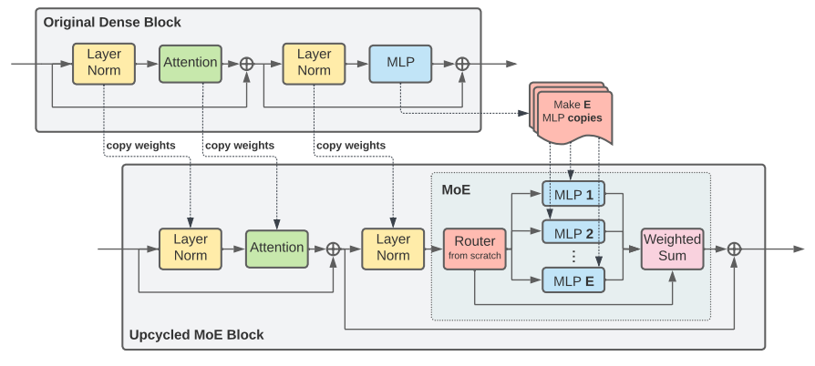

The biggest lesson we've learnt in the past few years is that scaling is the key for model performance. Scaling without sacrificing inference speed makes Mixture of Export (MoE) models very appealing for large language model training. Today we'll closely examine the Mixtral model to study MoE models. 


### Introduction
Most of today's MoE model are following an architecture that is similar to the Switch Transformer [1] which is shown below:
<p align="center">
     
    Figure 1. Switch MoE Model
    <br>
</p>

In these models, the sparsity lies in the feed-forward layer for the Transformer block. Switch is using one expert out of 4 experts for each token. For models like Mixtral/Grok both are using two experts out of 8 experts. Router dynamically chooses experts for each token. Can we route different samples to different experts? The answer is yes, however, coarse-grained design (giving less flexibility for model to learn the pattern) usually leads to worse performance.

The follow code snippet shows how it works for Mixtral MoE model at inference time. 

```python
# 注意：为了容易理解，我对代码进行了简化，同时不考虑batch size，实际使用时还是要用官方代码
class MixtralSparseMoeBlock(nn.Module):
    def __init__(self, config):
        super().__init__()
        self.gate = nn.Linear(self.hidden_dim, 8)
        self.experts = nn.ModuleList([MLP(config) for _ in range(8)])

    def forward(self, x):
        # 对每个token计算8个expert的权重，并将权重归一化
        router_logits = self.gate(x) 
        routing_weights = F.softmax(router_logits, dim=1) 
        # 每个token选择top-2 experts的权重、索引， 并将索引转为size=(len(tokens), 8)的独热编码
        routing_weights, selected_experts = torch.top2(routing_weights, dim=-1) 
        expert_mask = torch.nn.functional.one_hot(selected_experts, num_classes=8)
        # 重新将top-2 expert的权重归一化（因为删掉其余6个expert，权重的和不等于1了）
        routing_weights /= routing_weights.sum(dim=-1)  
            # 创建形状和x一致，初始值为0的矩阵，用来存储每个expert的输出
        final_hidden_states = torch.zeros_like(x) 
        for expert_idx in range(8):
            # 选择当前使用的expert
            expert_layer = self.experts[expert_idx] 
            # 选择当前expert对应的index
            idx_list, top_x_list = torch.where(expert_mask[expert_idx]) 
            # 选择需要计算的状态
            current_state = x[top_x_list] 
            # 选择当前expert对每个token的权重
            current_routing_weights = routing_weights.t()[top_x_list, idx_list] 
            # 将选择的状态输入给专家模型计算，并乘上权重
            current_hidden_states = expert_layer(current_state) * current_routing_weights 
            # 将每个expert的输出按照索引加到最终结果里
            final_hidden_states.index_add_(0, top_x_list, current_hidden_states) 
        return final_hidden_states
```


### Dynamic Routing

The workflow of topk router is as follows:

1. Calculate the logits by the router gating network.
2. Calculate the routing probabilities and map for top-k selection with score function.
3. [Optional] Apply token dropping to top-k expert selection.
4. [Optional] Apply the auxiliary load balancing loss for the given scores and routing map.

A typical Megatron-LM implementation is like below:

```python

def forward(self, input):
    # routing 
    self._maintain_float32_expert_bias()
    input = self.apply_input_jitter(input)
    # gating
    logits = torch.nn.functional.linear(input.to(router_dtype), self.gate_weight.to(router_dtype))
    # Apply Z-Loss
    logits = self.apply_z_loss(logits)
    # usually with loading balance loss here below.
    scores, routing_map, _ = topk_softmax_with_capacity(logits, top_k)

    # token dispatch    
    (dispatched_input, tokens_per_expert) = self.token_dispatcher.token_permutation(
        hidden_states, probs, routing_map
    )

    # experts forward
    expert_output, mlp_bias = self.experts(dispatched_input, tokens_per_expert)

    # unpermutate to restore the order
    output, mlp_bias = self.token_dispatcher.token_unpermutation(expert_output, mlp_bias)

```

There are a couple of ways to design router to route tokens to each expert. Ideally, we want to design a router that could make each expert specialize one of domains/tasks. Obviously there is no straightforward way to achieve this. In Mixtral, softmax-topk based gating mechanism is used to select experts. 

For any input $x$ of dimension $[\text{sequence\\_len}, \text{dim}]$, it multiplies with a gate matrix $W$ of shape $[\text{dim}, 8]$, then we get a router representation of shape $[\text{sequence\\_len}, 8]$. It selects top k (num of experts per token) logits which then go through softmax op to normalize to get k experts weights. In Mixtral, the k is equal to 2. 

MoE training is prone to instability issues because it has extra exponential functions. To deal with mixed precision roundoff errors, people apply z-loss to logits before sending them to router. 

$$
L_z = \frac{1}{B} \sum_{i=1}^{B} (log\sum_{j=1}^{N}e^{x_j^{(i)}})^2
$$

This is called router z-loss [9]. In python, 
```python
z_loss = torch.mean(torch.square(torch.logsumexp(logits, dim=-1))) * z_loss_coeff
```

Ref [7] uses the similar kind of approach to stabilize the training.
$$
L_{max_z} = 2 e^{-4} * z^2
$$
where $z$ is the max logit value.


### Load Balancing
For dynamic routing, which token is routed to which expert is unknown upfront, so there exists the load balancing issue. Common solution is to add an auxiliary load balancing loss [2].

$$
\text{loss} = \alpha \cdot N \cdot \sum_{i=1}^{N} f_i \cdot P_i
$$

Here $N$ is the number of experts, $T$ is the total number of tokens in batch $B$. $f_i$ is the fraction of tokens dispatched to expert $i$ and $P_i$ is the fraction of the router probability allocated for expert $i$, i.e. the summation of probability assigning token to expert i for all tokens
$$
P_i = \frac{1}{T} \sum_{x \in \mathcal{B}} p_i(x)
$$

Note that this loss is added for each MoE layer. 


#### Loss-free Load Balancing

Introducing an auxiliary loss to encourage load balance inevitably would bring non-negligible interference gradients into language training and most of time would impair the model performance. To overcome this issue, DeepSeek paper [11] proposed a loss free load balancing strategy. 

The idea is to introduce an expert-wise learnable bias term to modulate Top-k routing. Specifically, in the previous approach, the Top-k experts were selected based solely on their routing scores. In the new approach, the selection is based on the experts’ gating scores plus an expert bias term. When an expert is overloaded, its bias is decreased, thereby reducing the probability of it being activated; when an expert is underloaded, its bias is increased, thereby raising the probability of it being activated.

$$
g_{i,t} = \begin{cases}
s_{i,t}, & s_{i,t} + b_i \in \text{Topk}(\{s_{j,t} + b_j \mid 1 \leq j \leq N\}, K), \\\
0, & \text{otherwise}.
\end{cases}
$$


#### Expert Bias
There are some nuances in MoE expert bias implementations. The router/gating function computes logits + biases → softmax → expert probabilities.

If biases can’t capture small shifts, the softmax output may "lock in" certain experts and fail to distribute properly. That leads to expert bias (some experts dominate unfairly, others starve).

```python
import torch 
print(torch.tensor(0.5, dtype=torch.bfloat16) + 1e-3 )

# 0.001 is ignored
# tensor(0.5000, dtype=torch.bfloat16)
```

### Token Dispatch
Once the router outputs the assignment (e.g., token A → Expert 3, token B → Expert 7), the model must dispatch the tokens to the chosen experts. This involves:

- Gathering the tokens assigned to each expert.
- Sending them to the correct expert for computation.
- Collecting the expert outputs and reordering them back to match the original token sequence.
<div align="center">  Token dispatch in MoE, image from [12]</div>


### Training

Directly training MoE could be challenging due to low efficiency. One popular approach is called sparse upcycling to use pretrained dense model to initialize the sparse model and continue to train for certain steps.

<p align="center">
     
    Figure 2. Training MoE Model
    <br>
</p>


## Expert Parallelism


The logic of Expert Parallelism is shown in the figure below: each EP rank contains only a subset of experts, and the tokens on each EP rank are dispatched to the experts on other EP ranks according to the gating results. This process is carried out through all-to-all communication.


<div align="center">  EP in MoE, image from [10]</div>


### References
1. [Outrageously Large Neural Networks: The Sparsely-Gated Mixture-of-Experts Layer](https://arxiv.org/abs/1701.06538)
2. [Switch Transformers: Scaling to Trillion Parameter Models with Simple and Efficient Sparsity](https://arxiv.org/pdf/2101.03961.pdf)
3. [BASE Layers: Simplifying Training of Large, Sparse Models](https://arxiv.org/pdf/2103.16716.pdf) <br>
4. [Mixtral of Experts](https://arxiv.org/pdf/2401.04088.pdf) <br>
5. [Sparse Upcycling: Training Mixture-of-Experts from Dense Checkpoints](https://arxiv.org/abs/2212.05055) <br>
6. [Beyond Distillation: Task-level Mixture-of-Experts for Efficient Inference](https://arxiv.org/pdf/2110.03742.pdf)
7. [Baichuan 2: Open Large-scale Language Models](https://arxiv.org/abs/2309.10305)
8. [DeepSeek-V3 Technical Report](https://arxiv.org/html/2412.19437v1)
9. [ST-MoE: Designing Stable and Transferable Sparse Expert Models](https://arxiv.org/abs/2202.08906)
10. [GShard: Scaling Giant Models with Conditional Computation and Automatic Sharding](https://arxiv.org/abs/2006.16668)
11. [Auxiliary-Loss-Free Load Balancing Strategy for Mixture-of-Experts](https://arxiv.org/abs/2408.15664)
12. https://zhuanlan.zhihu.com/p/13997146226
13. https://github.com/pjlab-sys4nlp/llama-moe
14. https://github.com/NVIDIA/NeMo
15. https://github.com/hpcaitech/ColossalAI/tree/main/examples/language/openmoe
16. https://github.com/stanford-futuredata/megablocks
<!-- [6] https://zhuanlan.zhihu.com/p/674751021 -->
<!-- https://zhuanlan.zhihu.com/p/1893328591913189877 -->
<!-- https://zhuanlan.zhihu.com/p/18565423596 -->
