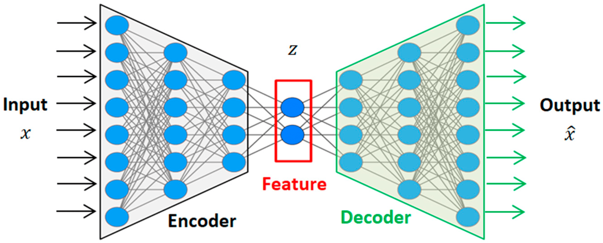
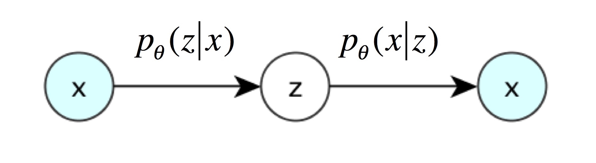

## From AE to VAE
An autoencoder has two main parts, encoder and decoder. Encoder compresses the input data into a smaller, lower-dimensional representation called a latent space or bottleneck. For example, a 784-dimensional image (like a 28x28 pixel MNIST image) might be compressed into a 32-dimensional vector. Decoder attempts to reconstruct the original input from the encoded (compressed) representation. This process in illustrated in the figure below.

     
    <em>Figure 1. Autoencoder</em>

Mathematically, this process can be represented as two transformations:

$$ 
\begin{aligned} 
z &= g(X) , z \in \mathbb{R}^d\\\
\hat{X} &= f(z)
\end{aligned}
$$

The decoder here promises us that we can input low dimension vector $z$ to get high-dimensional image data. Can we directly use this model as a generative model? i.e. randomly sample some latent vectors $ z $ in a low-dimensional space $ \mathbb{R}^d $, and then feed them into the decoder $ f(z) $ to generate images?

The answer is that no. Why? It's because we haven't explicitly modeled the distribution $p(z)$. We don’t know which $ z $ can generate useful images. The data that decoder is trained on is limited. But $ z $ lies in a vast space ($ \mathbb{R}^d $), and if we just randomly sample in this space, we naturally cannot expect to produce useful images.

Remember our objective is to find the distribution $p(X)$ such that we can generate images. From bayes rule, 
$$
p(X) = \sum_z{p(X|z)p(z)}
$$

If we explicitly model the $p(z)$, we might be able to get a good generative model which is the variational autoencoder. In practice, this is unrealistic because $z$ is in a big space, it's very hard to sample $z_i$ which is strongly correlated to $x_i$.

The solution is to get a normal distribution for the posterior $p_{\theta}(z | x_i)$. The process is as follows: 
1. Feed data sample $x_i$ to encoder and get posterior $p_{\theta}(z | x_i)$
2. From the posterior, we sample $z_i$ which is the latent representation of $x_i$
3. Feed $x_i$ to decoder, we get the distribution of $p(X | z_i)$. We think the generation of decoder (e.g. $\mu_i$, the mean is the recovered $x_i$).

The difference between AE and VAE is in step 2. Instead of directly using encoding as the input, we sample a vector $z_i$ as the input to the decoder. The smart part of this approach is that each sampling result $z_i$ is correlated to input $x_i$, thus we don't have to go through enormous sampling process.

     
    <em>Figure 2. Variational Autoencoder</em>

Sampling $z_i$ from distribution $\mathcal{N}(\mu, \sigma^2)$ ，is equivalent to sampling $\varepsilon$ from $\mathcal{N}(0, I)$. Thus, we get a constant from normal distribution. This is the so-called Reparameterization Trick. 

$$
z_i = \mu + \sigma \cdot \epsilon, \quad \epsilon \sim \mathcal{N}(0, 1)
$$

### Evidence Lower Bound
Using MLE to maximize $log(p(X))$, we have 

$$
\begin{aligned}
\log p_\theta(X) 
&= \int_z q_\phi(z \mid X) \log p_\theta(X) \, dz \quad  \\\
&= \int_z q_\phi(z \mid X) \log \frac{p_\theta(X, z)}{p_\theta(z \mid X)} \, dz \quad  \\\
&= \int_z q_\phi(z \mid X) \log \left( \frac{p_\theta(X, z)}{q_\phi(z \mid X)} \cdot \frac{q_\phi(z \mid X)}{p_\theta(z \mid X)} \right) \, dz \\\
&= \int_z q_\phi(z \mid X) \log \frac{p_\theta(X, z)}{q_\phi(z \mid X)} \, dz + \int_z q_\phi(z \mid X) \log \frac{q_\phi(z \mid X)}{p_\theta(z \mid X)} \, dz \\\
&= \ell(p_\theta, q_\phi) + D_{\mathrm{KL}}(q_\phi \| p_\theta) \\\
&\geq \ell(p_\theta, q_\phi) \quad 
\end{aligned}
$$

Here $q_\phi(z \mid X)$ is the posterior.

## VQ-VAE
Contrary to VAE, in VQ-VAE, the latent representation is discrete. The intution is that in nature, where is male and female, limited number of colors etc.

     
    <em>Figure 3. VQ-VAE </em>

The process is like the follows:
1. Input image $x$ into the encoder to obtain $z_e$:  
   $$
   z_e = \text{encoder}(x)
   $$

2. The codebook is a $K \times D$ table (purple blocks):  
   $$
   E = [e_1, e_2, \ldots, e_K]
   $$

3. Each dimension in $z_e$ is mapped to one of the $K$ embeddings in the codebook:  
   $$
   z_q(x) = e_k, \quad \text{where } k = \arg\min_j \| z_e(x) - e_j \|_2
   $$

4. After replacing all green parts in the image with the purple $z_q$, reconstruction is performed.
### References
1. https://zhuanlan.zhihu.com/p/348498294
2. https://zhuanlan.zhihu.com/p/34998569
3. https://zhuanlan.zhihu.com/p/2433292582