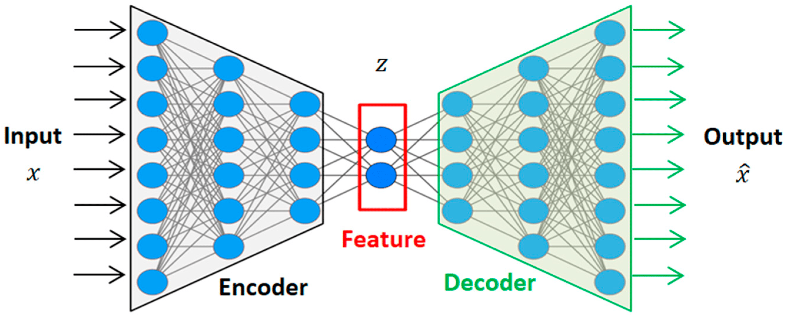
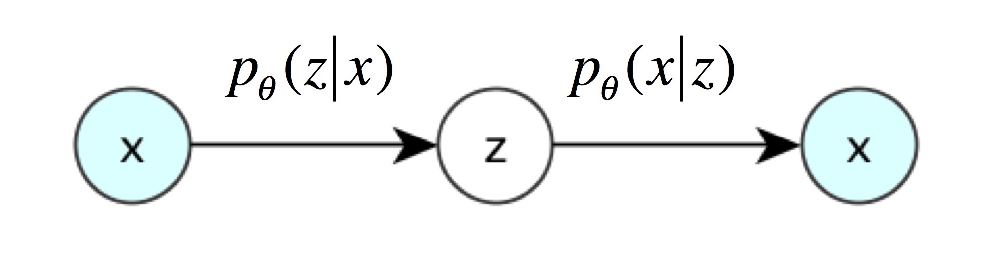
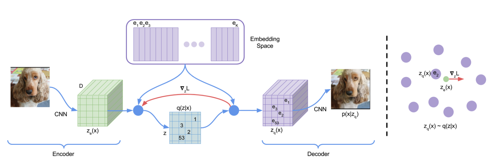

## Basics

Here we have a short recap about KL-divergence. The materials are mostly from [6].

1. Information

Information is defined as the log probability of event
$$
I(p) = -logp(x)
$$

Minus sign here is to get positive value. If an event is rare (low p), then it carries a lot of information when it happens.

2. Entropy

Shannon entropy is the average of information - the expectation of $I(p)$ with respect to the distribution $p(x)$
$$
\begin{aligned}
H(p) &= \mathbb{E}_{x \sim P}[I(p)] \\\
     &= \sum p(x)I(p) \\\
     &= -\sum p(x)\log p(x)
\end{aligned}
$$

Shannon entropy is the average(expected) information under the same distribution.

3. Cross-Entropy

The average of $I(q)$ with respect to the distribution $p(x)$
$$
\begin{aligned}
H(p, q) &= \mathbb{E}_{x \sim P}[I(q)] \\\
        &= \sum p(x)I(q) \\\
        &= -\sum p(x)\log q(x)
\end{aligned}
$$

Cross entropy is the average(expected) information under the different distribution.

4. KL-divergence

KL divergence is the relative entropy or information gain. 

$$
\begin{aligned}
D_{KL}(p||q) &= H(p, q) - H(p) \\\
             &= -\sum p(x)\log q(x) + \sum p(x)\log p(x) \\\
             &= -\sum p(x)\log \frac{q(x)}{p(x)} \\\
             &= \sum p(x)\log \frac{p(x)}{q(x)} \\\
             &= \mathbb{E}_{x \sim p(x)}[\log p(x) - \log q(x)]
\end{aligned}
$$

Relative entropy is the difference between cross entropy and shannon entropy.
Based on **Jensen's inequality**, we have 
$$
\begin{aligned}
-D_{KL}(p||q) &= \sum p(x)\log \frac{q(x)}{p(x)} \\\
              &<= \log \sum p(x) \frac{q(x)}{p(x)} \\\
              &= log 1 \\\
              &= 0
\end{aligned}
$$
Thus, KL-divergence is always positive. 

5. Forward and Reverse KL-divergence

Normally we say $D_{KL}(p||q)$ is forward KL and $D_{KL}(q||p)$ is reverse KL.

6. Minimizing KL-divergence

In machine learning, we generally believe that data distribution $p_{d}$ is the real distribution. Model's output $q_{m}$ is what is used to approximate $p_d$. 

$$
\begin{aligned}
D_{KL}(p_d \| q_m) &= -\sum_{i=1}^{n} p_d(x_i)\cdot\log q_m(x_i) + \sum_{i=1}^{n} p_d(x_i)\cdot\log p_d(x_i) \\
&= \mathbb{E}_{x \sim p_d(x)} [-\log q_m(x)] - \mathbb{E}_{x \sim p_d(x)} [-\log p_d(x)] \\
&= H(p_d, q_m) - H(p_d).
\end{aligned}
$$

$H(p_d)$ is data entropy, thus a constant. Thus minimizing KL divergence is equivalent to maximizing cross entropy. 

## AE
An autoencoder has two main parts, encoder and decoder. Encoder compresses the input data into a smaller, lower-dimensional representation called a latent vector. For example, a 784-dimensional image (like a 28x28 pixel MNIST image) might be compressed into a 32-dimensional vector. Decoder attempts to reconstruct the original input from the encoded (compressed) representation. This process in illustrated in the figure below.

     
    <em>Figure 1. Autoencoder</em>

Mathematically, this process can be represented as two transformations:

$$ 
\begin{aligned} 
z &= g(X) , z \in \mathbb{R}^d\\\
\hat{X} &= f(z)
\end{aligned}
$$

The loss function is defined as the reconstruction loss.
$$
\mathcal{L}_{AE}(x, \hat{x}) = \|x - \hat{x}\|^2
$$

The decoder here promises us that we can input low dimension vector $z$ to get high-dimensional image data. Can we directly use this model as a generative model? i.e. randomly sample some latent vectors $ z $ in a low-dimensional space $ \mathbb{R}^d $, and then feed them into the decoder $ f(z) $ to generate images?

The answer is that no. Why? It's because we haven't explicitly modeled the distribution $p(z)$. We don’t know which $ z $ can generate useful images. The data that decoder is trained on is limited. But $ z $ lies in a vast space ($ \mathbb{R}^d $), and if we just randomly sample in this space, we naturally cannot expect to produce useful images.

### Why AE Decoder Can Generate Images

- The decoder in AE is trained for reconstruction, not generation. The decoder in a vanilla autoencoder only learns to map valid latent codes (produced by the encoder) back to images.

- If we feed the decoder a random latent vector, the decoder doesn’t know how to interpret it — most likely we’ll get garbage or noise. In contrast, generative models (like VAEs, GANs, diffusion models) train the latent space to follow a structured distribution, so random samples make sense.

- No structured latent space. Autoencoders don’t enforce any probability distribution over the latent codes. This means the latent space is irregular and discontinuous. **Only codes near actual training examples reconstruct to meaningful images**. Generative models like VAEs add a regularization term (KL divergence) so the latent space follows, e.g., a Gaussian distribution. That’s what makes sampling possible.

To summarize, why AE can’t be a generative model: 

AE doesn’t model the distribution of latent variables $p(z)$ . If you randomly pick $z \in \mathbb{R}^d $ and decode, it usually produces junk. That’s because AE never learns what region of latent space corresponds to real data. 

A decoder becomes generative when it can take latent codes sampled from a known prior distribution (e.g., Gaussian) — not just from the encoder — and map them to meaningful, diverse outputs.

## VAE

Remember our objective is to find the distribution $p(X)$ such that we can generate images. From bayes rule, 
$$
p(X) = \sum_z{p(X|z)p(z)}
$$

If we explicitly model the $p(z)$, we might be able to get a good generative model which is the variational autoencoder. In practice, this is unrealistic because $z$ is in a big space, it's very hard to sample $z_i$ which is strongly correlated to $x_i$.

The solution is to put constaints on $z$'s distribution. Let's assume $p(z)$ follows a normal distribution. 

In practice we use encoder to approximate the posterior $p_{\theta}(z | x_i)$, the approximate distribution is $q_{\phi}(z \mid x)$. 

Then the generation process is as follows: 
1. Feed data sample $x_i$ to encoder and get posterior $p_{\theta}(z | x_i)$, which is a normal distribution

$$
q_{\phi}(z \mid x) = \mathcal{N}\big(z;\, \mu_{\phi}(x),\, \sigma_{\phi}^2(x) I \big)
$$
It is a multivariate Gaussian distribution with independent dimensions. Why we want it to be a Gaussian distribution, because we can let encoder to output $\mu, \sigma$ to model it. Note that the notation here $q_{\phi}$ is encoder fitting posterior parameterized by $\phi$ and $p_{\theta}$ the real posterior.

2. From the posterior, we sample $z_i$ which is the latent representation of $x_i$

Sampling $z_i$ from distribution $\mathcal{N}(\mu, \sigma^2)$，is equivalent to sampling $\varepsilon$ from $\mathcal{N}(0, I)$. Thus, we get a constant from normal distribution. This is the so-called Reparameterization Trick. 
$$
z_i = \mu + \sigma \cdot \epsilon, \quad \epsilon \sim \mathcal{N}(0, 1)
$$

3. Feed $x_i$ to decoder, we get the distribution of $p(X | z_i)$. We think the generation of decoder (e.g. $\mu_i$, the mean is the recovered $x_i$).

The core idea of a VAE is to treat the latent vector as a probability distribution. The difference between AE and VAE is in step 2. Instead of directly using encoding as the input, we sample a vector $z_i$ as the input to the decoder. The smart part of this approach is that each sampling result $z_i$ is correlated to input $x_i$, thus we don't have to go through enormous sampling process.

     
    <em>Figure 2. Variational Autoencoder</em>

Now that we know each element in the latent vector is a normal distribution, normally we would want to put some constraints on its distribution. For instance, we don't want it to have very small variance such that it collapses into a constant distribution. In this case, the VAE becomes AE. Since the objective is to constrain the output distribution to follow a normal distribution, the Kullback–Leibler (KL) divergence is utilized for regularization. From here we have the two components of VAE loss function: reconstruction loss and KL divergence regularization loss.

### VAE Loss

From MLE perspective, to get a generative model, we want to learn a model to maximize

$$
\begin{aligned}
L(\theta) &= \log \prod_{x \in X} p(x; \theta) \\
&= \sum_{x \in X} \log p(x; \theta)
\end{aligned}
$$

To simplify, we can consider single example case. Considering the latent variable $z$, we can rewrite the above as a joint probability:
$$
\log p(x; \theta) = \log \sum_z p(x, z; \theta)
$$

Using Jensen inequality, we can have:

$$
\begin{aligned}
\log p(x; \theta) &= \log \sum_z p(x, z; \theta) \\
&=\log \sum_z Q(z) \frac{p(x, z; \theta)}{Q(z)} \\
&=\log E_{z \in Q(z)} \left[ \frac{p(x, z; \theta)}{Q(z)} \right] \\
&\geq E_{z \in Q(z)} \left[ \log \frac{p(x, z; \theta)}{Q(z)} \right]
\end{aligned}
$$

This is what is called Evidence Lower Bound (ELBO). 

Since encoder approximates the posterior, we can use $q(z|x; \phi)$ to replace the $Q(z)$ in the above equation. 

$$
\begin{aligned}
ELBO(\theta, \phi) &= E_{z \in Q(z)} \left[ \log \frac{p(x, z; \theta)}{Q(z)} \right] \\
&= E_{z \in q(z|x; \phi)} \left[ \log \frac{p(x, z; \theta)}{q(z|x; \phi)} \right] \\
&= E_{z \in q(z|x)} \left[ \log \frac{p(x|z; \theta) \times p(z)}{q(z|x; \phi)} \right] \\
&= E_{z \in q(z|x)} \left[ \log p(x|z; \theta) \right] + E_{z \in q(z|x; \phi)} \left[ \log \frac{p(z)}{q(z|x; \phi)} \right] \\
&= E_{z \in q(z|x)} \left[ \log p(x|z; \theta) \right] - D_{KL}(q(z | x; \phi) || p(z)) \\
\end{aligned}
$$

$E_{z \in q(z|x)} \left[ \log p(x|z; \theta) \right]$ is called reconstruction loss and is usually computed by sampling from $q(z|x; \phi)$

$$
E_{z \in q(z|x)} \left[ \log p(x|z; \theta) \right] \approx \frac{1}{m} \sum_{i=1}^{m} \log p (X | z_i; \theta)
$$

In practice, $m$ is often chosen to be 1. When variance is a constant, the MLE becomes MSE. This part can use MSE to compute.

Similarly for continuous variable we can also use MLE to maximize $log(p(X))$, we have 

$$
\begin{aligned}
\log p_\theta(X) 
&= \int_z q_\phi(z \mid X) \log p_\theta(X)  dz \quad  \\\
&= \int_z q_\phi(z \mid X) \log \frac{p_\theta(X, z)}{p_\theta(z \mid X)}  dz \quad  \\\
&= \int_z q_\phi(z \mid X) \log \left( \frac{p_\theta(X, z)}{q_\phi(z \mid X)} \cdot \frac{q_\phi(z \mid X)}{p_\theta(z \mid X)} \right)  dz \\\
&= \int_z q_\phi(z \mid X) \log \frac{p_\theta(X, z)}{q_\phi(z \mid X)} \, dz + \int_z q_\phi(z \mid X) \log \frac{q_\phi(z \mid X)}{p_\theta(z \mid X)}  dz \\\
&= \ell(p_\theta, q_\phi) + D_{\mathrm{KL}}(q_\phi \| p_\theta) \\\
&\geq \ell(p_\theta, q_\phi) \quad 
\end{aligned}
$$

Here $q_\phi(z \mid X)$ is the posterior.

## VQ-VAE

A VAE can encode an image into a vector that follows a standard Gaussian distribution. The reason for making the vector follow a standard Gaussian distribution is to facilitate random sampling. Note that the vectors encoded by a VAE are continuous vectors, meaning each dimension of the vector is a floating-point number. If you slightly change one dimension of the vector, the decoder can still recognize the vector and generate an image that is very similar to the one corresponding to the original vector.

Contrary to VAE, in VQ-VAE, the latent representation is discrete. The intuition is that in nature, where is male and female, limited number of colors etc.

     
    <em>Figure 3. VQ-VAE </em>

The process is like the follows:
1. Input image $x$ into the encoder to obtain $z_e$:  
   $$
   z_e = \text{encoder}(x)
   $$

2. The codebook is a $K \times D$ table (purple blocks):  
   $$
   E = [e_1, e_2, \ldots, e_K]
   $$

3. Each dimension in $z_e$ is mapped to one of the $K$ embeddings in the codebook:  
   $$
   z_q(x) = e_k, \quad \text{where } k = \arg\min_j \| z_e(x) - e_j \|_2
   $$

4. After replacing all green parts in the image with the purple $z_q$, reconstruction is performed.

VQVAE uses codebook to replace the latent distribution in VAE. However in this way, the input to decoder becomes a fixed vector again like an autoencoder. To solve this issue, VQVAE trained a autoregressive model to fit the codebook. in this way, we can do generation again.

### How VQ-VAE trains an autoregressive model 

VQ-VAE needs something  like an autoregressive prior to regain the generative capability that a VAE naturally has via sampling. The missing piece is the **prior** over the discrete latent codes. VQ-VAE learns this in two stages:

#### Step 1.  Train the VQ-VAE

Train the encoder, codebook, and decoder using the reconstruction loss + codebook commitment loss. After training, we have a dataset of latent codes (discrete indices into the codebook) corresponding to the training data.

#### Step 2: Learn a prior with an autoregressive model

- Take the sequence of latent code indices produced by the encoder for your training data.
- Train a powerful autoregressive model (PixelCNN, PixelSNAIL, or Transformer) on these code sequences.
    - If the latent map is 2D (like an image grid of discrete codes), you flatten or use masked convolutions to model the spatial dependencies.
    - The autoregressive model learns $P(z) = \prod_i P(z_i | z_{<i})$, where each $z_i$ is a code index.

- This prior learns the distribution of code sequences across your dataset.

#### Step 3: Generation

- Sample a sequence of latent codes from the autoregressive prior.
- Pass these codes through the decoder to generate a new image (or audio, depending on domain).

That’s how VQ-VAE restores the generative power: instead of sampling from a Gaussian prior (like in a VAE), it samples from a learned discrete autoregressive prior.

## References
1. [Auto-Encoding Variational Bayes](https://arxiv.org/abs/1312.6114)
2. [Neural Discrete Representation Learning](https://arxiv.org/abs/1711.00937)
3. https://zhuanlan.zhihu.com/p/348498294
4. https://zhuanlan.zhihu.com/p/34998569
5. https://zhuanlan.zhihu.com/p/2433292582
6. https://zhuanlan.zhihu.com/p/425693597
7. https://zhuanlan.zhihu.com/p/719968411
<!-- https://zhuanlan.zhihu.com/p/346518942 -->
