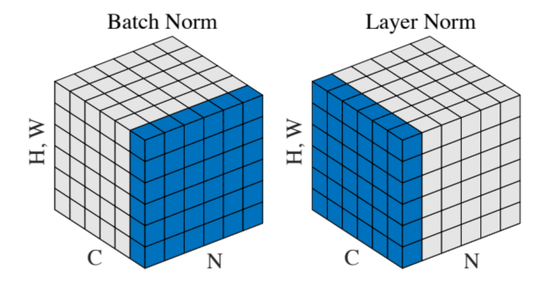

## LayerNorm vs BatchNorm

BatchNorm is commonly used in computer vision. LayerNorm is widely used in NLP. In CV, the channel dimension is RGB channel. In NLP, the channel dimension is feature dimension (embedding dimension). 
Layer norm normalizes across feature dimension (i.e embedding dimension) for each of the inputs which removes the dependence on batches. This makes layer normalization well suited for sequence models such as transformers.
<p align="center">
     
    <em>Figure 1. batch norm vs layer norm</em>
    <br>
</p>

After understanding of the basics, we can write down the pseudo code as below
Pseudo code for batch norm
```python
for i in range(seq_len):
    for j in range(hidden_size):
        Norm([bert_tensor[k][i][j] for k in range(batch_size)])
```

Pseudo code for layer norm
```python
for i in range(batch_size):
    for j in range(seq_len):
        Norm([bert_tensor[i][j][k] for k in range(hidden_size)])
```

PyTorch implementation is shown blow. When using for BatchNorm, dim=0, assuming x is of the shape (batch_size, H, W, channel). When using for LayerNorm, dim=-1, assuming x is of shape (batch_size, seq_len, embed_dim). 
```python
class Norm(nn.Module):
    def __init__(self, num_features, variance_epsilon=1e-12):
        super(Norm, self).__init__()
        self.gamma = nn.Parameter(torch.ones(num_features))
        self.beta = nn.Parameter(torch.zeros(num_features))
        self.variance_epsilon = variance_epsilon

    def forward(self, x, dim):
        # layer norm, x is [bz, seq_len, dim], u is [bz, seq_len, 1], x_norm is the same shape with u
        u = x.mean(dim, keepdim=True)
        s = (x - u).pow(2).mean(dim, keepdim=True)
        x_norm = (x - u) / torch.sqrt(s + self.variance_epsilon)
        return self.gamma * x_norm + self.beta
```


### EMA in BN
Note that at inference time, there could be no batch dimension for batch norm. In practice, during training people will keep record of moving average of mean and variance. During inference time, these values will be used. The exponential moving average is calculated as follows
```
moving_mean = moving_mean * momentum + batch_mean * (1 - momentum)
moving_var = moving_var * momentum + batch_var * (1 - momentum)
```
The momentum is a hyperparameter which is generally chosen to be close to 1. A lower value of momentum means that older values are forgotten sooner. A more efficient way to calculate it is as follows:
```
moving_mean -= (moving_mean - batch_mean) * (1 - momentum)
moving_var -= (moving_var - batch_var) * (1 - momentum)
```


## Position Encoding

In `Attention is All You Need` paper, absolute sinusoidal positional embedding was proposed which has the following format. Here $t$ is the position index, starting from 0, 1... $i$ is the ith component in (head) dimension.

$$
\begin{aligned}
p_{t,2i} &= \sin\left( \frac{t}{10000^{2i/d}} \right) \\\
p_{t,2i+1} &= \cos\left( \frac{t}{10000^{2i/d}} \right)
\end{aligned}
$$

The paper didn't really talk about why it design the positional embedding in such a way, but it's generally believed it's used to break the symmetrical structure of the self-attention, meaning that

$$
attn(x_{0}, x_{1}, .. x_{t_1}, x_{t_2}.. x_n) \neq attn(x_{0}, x_{1}, .. x_{t_2}, x_{t_1}.. x_n)
$$ 


### Rope
It encodes positional information in a way that allows the model to understand both the absolute position of tokens and their relative distances. This is achieved through a rotational mechanism, where each position in the sequence is represented by a rotation in the embedding space.
The rotation transformation can be represented below

$$
\begin{aligned}
f(x_m, m)=
\begin{pmatrix}
\cos m\theta & -\sin m\theta \\\
\sin m\theta & \cos m\theta
\end{pmatrix}
\begin{pmatrix}
x_m^{(1)} \\\
x_m^{(2)}
\end{pmatrix}
\end{aligned}
$$

Rotary uses the same choice of $\theta$. 
$$
\theta_k = 10000^{-\frac{2k}{d}}
$$

It can bring a certain degree of remote attenuation. (see section 3.4.3 in Ref [3])


Process to compute rotary positional embedding based self-attention
- First compute the position encoding for each position namely $m\theta$
- Second, doing rotation with query, key vector
- Self-attention


### Long Context Expansion
Ref [1] proposed ABF method to increase base frequency from 10, 000 to 500, 000 which essentially reduces the rotation angles of each dimension. LongRope proposed to adjust the rotation frequency on different dimensions. 


## References
1. https://spaces.ac.cn/archives/8231
2. Effective Long-Context Scaling of Foundation Models
3. RoFormer: Enhanced Transformer with Rotary Position Embedding
4. LongRoPE: Extending LLM Context Window Beyond 2 Million Tokens
5. LongRoPE2: Near-Lossless LLM Context Window Scaling

