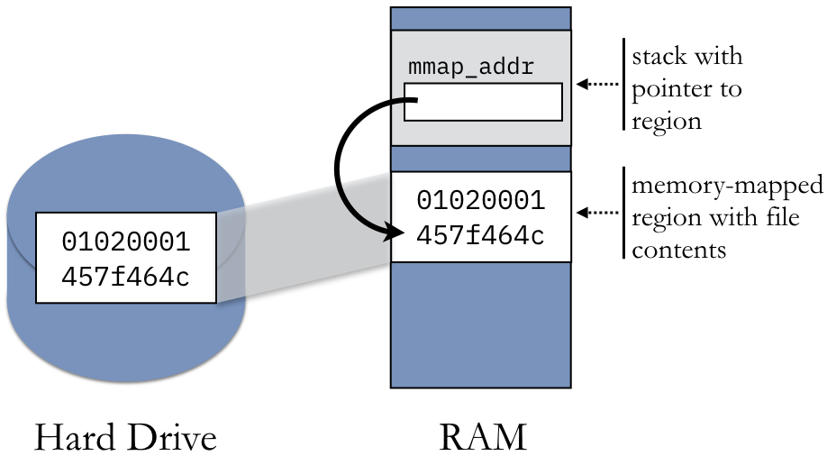
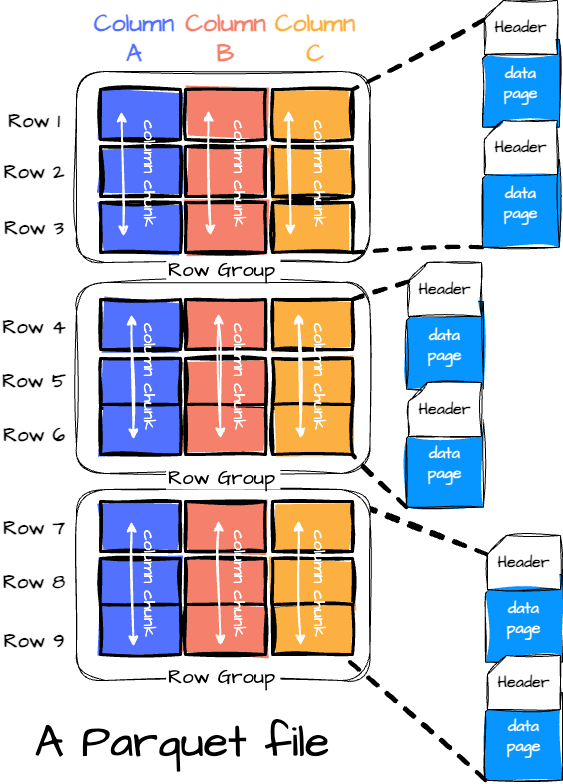

A memory mapping is a region of the process’s virtual memory space that is mapped in a one-to-one correspondence with another entity. In this section, we will focus exclusively on memory-mapped files, where the memory of region corresponds to a traditional file on disk. For example, assume that the address 0xf77b5000 is mapped to the first byte of a file. Then 0xf77b5001 maps to the second byte, 0xf77b5002 to the third, and so on.

When we say that the file is mapped to a particular region in memory, we mean that the process sets up a pointer to the beginning of that region. The process can the dereference that pointer for direct access to the contents of the file. Specifically, there is no need to use standard file access functions, such as read(), write(), or fseek(). Rather, the file can be accessed as if it has already been read into memory as an array of bytes. Memory-mapped files have several uses and advantages over traditional file access functions:

- Memory-mapped files allow for multiple processes to share read-only access to a common file. As a straightforward example, the C standard library (glibc.so) is mapped into all processes running C programs. As such, only one copy of the file needs to be loaded into physical memory, even if there are thousands of programs running.
- In some cases, memory-mapped files simplify the logic of a program by using memory-mapped I/O. Rather than using fseek() multiple times to jump to random file locations, the data can be accessed directly by using an index into an array.
Memory-mapped files provide more efficient access for initial reads. When read() is used to access a file, the file contents are first copied from disk into the kernel’s buffer cache. Then, the data must be copied again into the process’s user-mode memory for access. Memory-mapped files bypass the buffer cache, and the data is copied directly into the user-mode portion of memory.
- If the region is set up to be writable, memory-mapped files provide extremely fast IPC data exchange. That is, when one process writes to the region, that data is immediately accessible by the other process without having to invoke a system call. Note that setting up the regions in both processes is an expensive operation in terms of execution time; however, once the region is set up, data is exchanged immediately.
- In contrast to message-passing forms of IPC (such as pipes), memory-mapped files create persistent IPC. Once the data is written to the shared region, it can be repeatedly accessed by other processes. Moreover, the data will eventually be written back to the file on disk for long-term storage.

<p align="center">
     
    <em>mmap file</em>
    <br>
</p>


## Data Format


### Apache Arrow
Key Features of the Arrow Format:
- Columnar Layout: Stores data column-by-column instead of row-by-row, which is great for analytical processing.
- In-Memory Format: It’s optimized for in-memory operations and can be shared across processes.
- Efficient Serialization: The format can be serialized (saved to disk or sent over the wire) with minimal overhead.
- Language Interoperability: Data can be shared between Python, Java, R, and more without conversion.


### Parquet
Row-wise formats store data as records, one after another, much like a relational database table. The issue with row-wise storage is that when we need to access a specific column, e.g. aggregate the number of products sold on Amazon, we have to scan the whole dataset. 
Column-wise formats stores data based on fields thus we could quickly access specific columns. However, it could be slow when we want to update/write multiple fields because such ops could touch multiple column blocks on storage. 
Parquet solves this problem utilizing a mixed of both row-wise and column-wise design of data format. 
<p align="center">
     
    <em>parquet data format, image from [1]</em>
</p>

- Row group: multiple data records form a row group
- Column chunk: each field has a column chunk in the row group. 
- Pages: each column chunk can further be divided as pages. 
    - Dictionary page: contains information related to how values are encoded. (Note that parquet offers compression option for data)
    - Index page: fast data access
    - Data page: data chunk

Parquet file can be stored in multiple files, the application can read them simultaneously with multi-threading. A single Parquet file is partitioned horizontally (row groups) and vertically (column chunks), which allows the application to use multi-thread to read data in parallel to the read on the row group or column level.

### Comparison

| Feature                | **In-Memory Format (e.g., Arrow, NumPy)** | **Disk-Based Format (e.g., Parquet, CSV)** |
|------------------------|-------------------------------------------|--------------------------------------------|
| **Speed**              | Very Fast ⚡ (RAM access)                  | Slower (Disk I/O needed)                   |
| **Storage Efficiency** | Less efficient (uncompressed)             | Highly compressed (Parquet)                |
| **Columnar Storage**   | Yes (Arrow)                               | Yes (Parquet)                              |
| **Zero-Copy Reads**    | Yes (No duplication)                      | No (Requires reloading)                    |
| **Persistence**        | No (Lost when session ends)               | Yes (Stored permanently)                   |


In practice, we can combine pyarrow and parquet to process file. Parquet is a compressed, columnar storage format. PyArrow is optimized for reading/writing Parquet files extremely fast. For example:
```python
import pyarrow as pa
import arrow
import pyarrow.parquet as pq

schema = pa.schema([
        ("symbol", pa.string()),
        ("frame", pa.date64()),
        ("open", pa.float32()),
        ("high", pa.float32()),
        ("low", pa.float32()),
        ("close", pa.float32()),
        ("volume", pa.float64()),
        ("money", pa.float64()),
        ("factor", pa.float64())
])


async def save_1m_bars(codes, dt: datetime.datetime):
    tables = None

    for code in codes:
        bars = await Stock.get_bars(code, 240, FrameType.MIN1, end=dt)
        data = [[code] * len(bars)]

        data.extend([
                    bars[key] for key in bars.dtype.names
                ])
        table = pa.Table.from_arrays(data, schema=schema)
        if tables is None:
            tables = table
        else: # 拼接表
            tables = pa.concat_tables([tables, table])

    # 写入磁盘
    name = arrow.get(dt).format("YYYY-MM-DD")
    pq.write_table(tables, f"/tmp/pyarrow/1m/{name}.parquet")


codes = ["000001.XSHE", "600000.XSHG"]
for i in (25, 26, 27, 28, 29):
    dt = datetime.datetime(2023, 12, i, 15)
    await save_1m_bars(codes, dt)

```


## References
1. https://vutr.substack.com/p/the-overview-of-parquet-file-format
<!-- https://zhuanlan.zhihu.com/p/675767714 -->