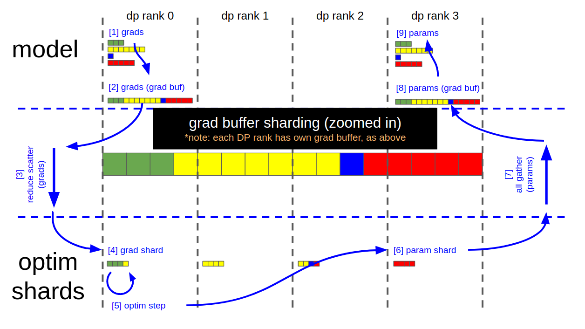

In this blog, we talk about distributed optimizer implementation. The discussion here is mostly based on Megatron-LM.

## Adam Optimizer
Adaptive moment estimation is an algorithm to compute the adaptive learning rate for each parameters. It consists two parts: first-order momentum which is exponentially decaying average (moving average) of gradient and second-order momentum (variance, which controls adaptive learning rate) which is exponentially decaying average of squared gradient.
$$
m_t = \frac{\beta_1}{1 - \beta_{1}^{t}} m_{t-1} + \frac{1 - \beta_1}{1 - \beta_{1}^{t}} g_{t} \\\\[5pt]
v_t = \frac{\beta_2}{1 - \beta_{2}^{t}} v_{t-1} + \frac{1 - \beta_2}{1 - \beta_{2}^{t}} g_{t}^2 \\\\[5pt]
u_t = \frac{m_t}{\sqrt{v_t} + \epsilon} \\\\[5pt]
\theta_{t+1} = \theta_t - \eta_t u_t
$$

We can think about the adaptive learning rate part monitors the historical update frequency for each parameter. For frequently updated parameters, we don't want them to be updated very often with a single sample, thus, we would like to have a smaller learning rate. The updating frequency is measured by $v = \sum g^2$. 

Note that adaptive learning sometimes can be problematic when training data is huge. The reason is that when $v$ monotonically increases, it could yield very small learning rate. Essentially, model won't be able to learn anything.  

## Memory Footprint in Training
The full spectrum of memory consumption of training system can be categorized into three parts:
1. Model weights
2. Optimizer states
3. Activations, temporary buffers and fragmented memory

As most of modern training is done in mixed precision training (such as bf16 and fp32), so here our analysis will be based on these scenarios. 
When use the above Adam optimizer and assuming the model parameter is $M$, then the memory footprint could include:
- 2M (model parameter in bf16)
- 2M (gradient in bf16)
- 4M (fp32 model parameter in optimizer state)
- 4M (fp32 gradient in optimizer state)
- 4M (fp32 grad moving avg)
- 4M (fp32 grad sq moving avg)

In total, we need 20M memory to per replica in model training. For instance, for 7B model training, the above parameters and optimizer state will consume 140G memory. Refer to [1] for how to compute the activation part. Keeping a fp32 copy of model parameters for model update in optimizer state is important for performance as is shown in Gopher paper. 

## Distributed Optimizer

Distributed optimizer is to save memory by distributing the optimizer state evenly across data parallel ranks, versus the current method of replicating the optimizer state across data parallel ranks.

Theoretical memory savings vary depending on the combination of the model's param dtype and grad dtype. In the Megatron-LM implementation, the theoretical number of bytes per parameter is (where 'd' is the data parallel size):

|        | Non-distributed optim | Distributed optim |
| ------ | ------ | ------ |
| float16 param, float16 grads | 20 | 4 + 16/d |
| float16 param, fp32 grads    | 18 | 6 + 12/d |
| fp32 param, fp32 grads       | 16 | 8 + 8/d  |

### Data flow
The following image shows the data flow of the optimizer. Here I'll give a thorough walk-through about how this works.

     
    Figure 1. Distributed optimizer data flow
     

## Reference
1. Reducing Activation Recomputation in Large Transformer Models
