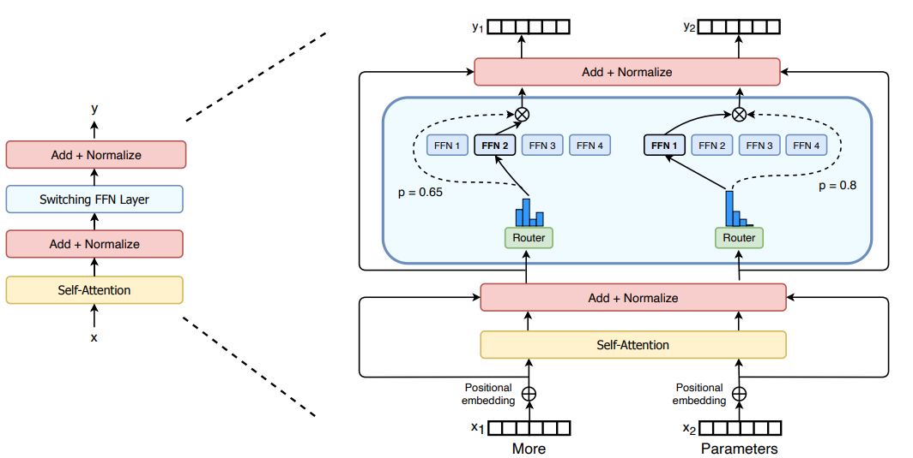
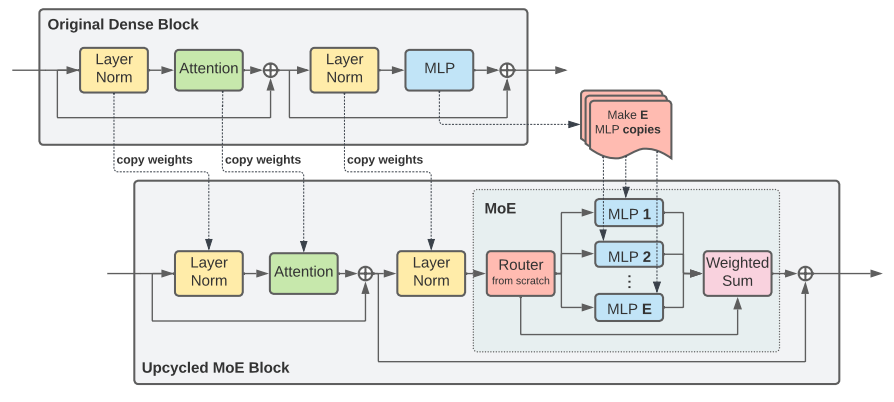

The biggest lesson we've learnt in the past few years is that scaling is the key for model performance. Scaling without sacrificing inference speed makes Mixture of Export (MoE) models very appealing for large language model training. Today we'll closely examine the Mixtral model to study MoE models. 

### Introduction
Most of today's MoE model are following an architecture that is similar to the Switch Transformer [1] which is shown below:

     
    Figure 1. Switch MoE Model
     

In these models, the sparsity lies in the feed-forward layer for the Transformer block. Switch is using one expert out of 4 experts for each token. For models like Mixtral/Grok both are using two experts out of 8 experts. Router dynamically chooses experts for each token. Can we route different samples to different experts? The answer is yes, however, coarse-grained design (giving less flexibility for model to learn the pattern) usually leads to worse performance.

### Dynamic Routing

There are a couple of ways to design router to route tokens to each expert. Ideally, we want to design a router that could make each expert specialize one of domains/tasks. Obviously there is no straightforward way to achieve this. In Mixtral, softmax-topk based gating mechanism is used to select experts. 

For any input $x$ of dimension $[\text{sequence\\_len}, \text{dim}]$, it multiplies with a gate matrix $W$ of shape $[\text{dim}, 8]$, then we get a router representation of shape $[\text{sequence\\_len}, 8]$. It selects top k (num of experts per token) logits which then go through softmax op to normalize to get k experts weights. In Mixtral, the k is equal to 2. 

### Load Balancing
For dynamic routing, which token is routed to which expert is unknown upfront, so there exists the load balancing issue. Common solution is to add an load balancing loss.

### Training

Directly training MoE could be challenging due to low efficiency. One popular approach is called sparse upcycling to use pretrained dense model to initialize the sparse model and continue to train for certain steps.

     
    Figure 2. Training MoE Model
     

(To be continued)

#### Public Implementations
 - https://github.com/XueFuzhao/OpenMoE
 - https://github.com/pjlab-sys4nlp/llama-moe
 - https://github.com/NVIDIA/NeMo
 - https://github.com/hpcaitech/ColossalAI/tree/main/examples/language/openmoe
 - https://github.com/stanford-futuredata/megablocks
 

### References
[1] [Outrageously Large Neural Networks: The Sparsely-Gated Mixture-of-Experts Layer](https://arxiv.org/abs/1701.06538)  
[2] [Switch Transformers: Scaling to Trillion Parameter Models with Simple and Efficient Sparsity](https://arxiv.org/pdf/2101.03961.pdf)  
[3] [BASE Layers: Simplifying Training of Large, Sparse Models](https://arxiv.org/pdf/2103.16716.pdf)  
[4] [Mixtral of Experts](https://arxiv.org/pdf/2401.04088.pdf)  
[5] [Sparse Upcycling: Training Mixture-of-Experts from Dense Checkpoints](https://arxiv.org/abs/2212.05055)  
[6] [Beyond Distillation: Task-level Mixture-of-Experts for Efficient Inference](https://arxiv.org/pdf/2110.03742.pdf)
<!-- [6] https://zhuanlan.zhihu.com/p/674751021 -->