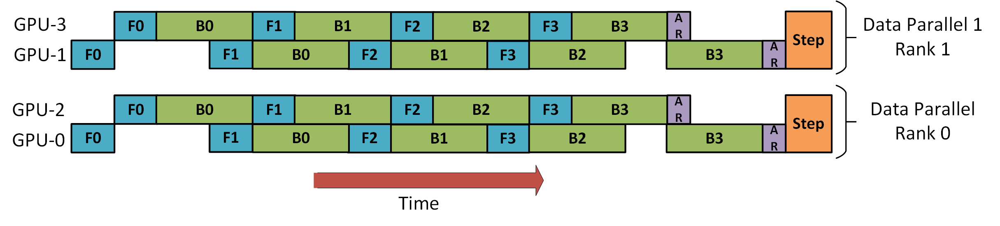

Modern large language model usually is trained with billions number of parameters and trillions number of tokens. With model size and training data at such scale, computation resource and memory footprint requirement is huge. How to effectively leverage GPU resources to speed up training is an important topic in language model pretraining. In this blog, we'll dive deep into parallel training in recent distributed training paradigms. 

A lot of contents of here are from OpenAI, Nvidia, Deepspeed and bigscience blogs. We'll first go through different parallelism techniques and then talk about how to combine them to maximize training efficiency. 

### Data Parallelism
Data parallelism (DP) is the most straightforward way of parallel training. With data parallelism, model parameters and optimzer states are replicated across different workers. Data is partitioned into the same number of shards and each replicate of model is fed with one shard of data. Forward and backward computation is in parallel (simutaneously) and then there is a synchronization step where gradients are averaged across workers to update parameters. The DP computation can be summarized as the following [three steps](https://www.adept.ai/blog/sherlock-sdc):

```
Each machine computes local gradients given local inputs and a consistent global view of the parameters.
LocalGrad_i = f(Inputs_i, Targets_i, Params)

Sum up all the local gradients and distribute that sum to each machine, so there is a consistent global view of the gradients.
GlobalGrad = all_reduce(LocalGrad_i)

Each machine can now locally update the parameters and optimizer state under the assumption that the exact same calculation will happen on all machines.
NewParams, NewOptimState = g(Params, OldOptimState, GlobalGrad)
```


### Pipeline Parallelism
Pipeline parallelism (PP) is from model parallelism. Model parallelism is initially proposed to solve that challenge that one model can't fit into one GPU. The idea is we can vertically slice model into different layers (e.g. one or more layers in transformer models) and put different layers in different GPUs. The issue with this method is that because sequential computation order of layers, if we feed single large batch data into one of the workers, all other workers are idle. This is the so-called `bubble` waiting time.  

To solve the problem, we can reuse the data parallelism idea. Instead of feeding a single large batch into a model shard, we can partition data into small chunks. Each chunk of data goes through different model shards (workers) in a pipeline way. The following figure illustrates how this works. 

<p align="center">
    
    <br>
    <em>Pipeline parallelism. image from [4]</em>
</p>

### Tensor Parallelism
The bottleneck of neural network training is compute. Among all the computation parts, the general matrix multiplication (GEMM) consumes the most of time. One way to parallize the matrix multiplication is to use matrix decomposition. Specifically, we can split a matrix into two or multiple parts based on row or column. Then we can aggregate results after the computation of each parts in the end. This is the core idea of tensor parallelism (TP).

In it's essence, tensor parallelism is block matrix mutiplication. Based on how we partition the parameter matrix, there is row parallel partition and column parallel partition. 
For row parallel partition, there is

$$
Y = XW = \begin{bmatrix} X_1, & X_2\end{bmatrix} \begin{bmatrix} W_1 \\\ W_2\end{bmatrix} = X_1W_1 + X_2W_2
$$

For column parallel partition, there is
$$
Y = XW = X\begin{bmatrix} W_1 \\\ W_2\end{bmatrix} = XW_1 + XW_2
$$
Note that for row parallel, we need to partition the input into two parts as well.
In original transformer MLP layer, there are two projection steps: `hidden.size -> 4 * hidden.size -> hidden.size`. In this case, in Megatron-LM MLP implementation, it first does column parallel partition, generating two matrices, then a row parallel partition. This is shown in the following figure:
<p align="center">
    
    <em>Tensor Parallelism in Megatron-LM</em>
    <br>
</p>

<!-- $$\begin{bmatrix} 
a & b \\\
d & e 
\end{bmatrix}
$$ -->

As these three parallelism is orthogonal to each other, it's easy to combine them together. The following diagram shows how to combine pipeline parallelism with data parallelism. 
<p align="center">
    
    <em>Combination of pipeline parallelism and data parallelism. Image from Deepspeed tutorial</em>
</p>


### ZeRO DP
Zero Redundancy Optimizer (ZeRO) is an optimizied data parallelism proposed by Deepspeed team. The idea is instead of replicating the whole model, optimizer on each of workers, we can only store needed part. 

<p align="center">
    
    <em>Zero DP. Image from Deepspeed</em>
    <br>
</p>


### Parallelism in Megatron
Megatron-LM and NeMo are the open source libraries from Nvidia for the distributed training. In these two libs, there are two constraints for the parallelism settings.
```
- world_size = TP * PP * DP
- global_batch_size % (PP * DP) == 0
```

### [Sequence Parallel](https://browse.arxiv.org/pdf/2205.05198.pdf)
For operations such as layer normation, the operation can be paralleized on the sequence dimension. Remember that layernorm is normalization over the feature dimenstion, ie. a token representation of 2048 will be normalized over 2048 numbers. In light of this, sequence parallel is proposed to reduce GPU memory consumption. 
<p align="center">
    
    <em>Sequence parallelism</em>
    <br>
</p>


### Implementation
A few key points in 3D parallelism implementation. 
- TP is communication heavy, thus TP blocks should be put on different GPUs within the same node to leverage fast NVLink communication. On the contrary, PP communication is light, and it is usually put across nodes. 
- Within a data parallel group, all GPUs hold the same model parameters. After each update, there will be gradient all-reduce operation.  

How to achieve this, in Megatron-LM, this is achieved by first partition all GPUs by pipeline parallelism. Then withnin the same pipeline block, partition GPUs based on tensor parallelism. After that, the number of copies within the pipeline block will be the data parallelism number. 


### Training Efficiency Metric
A simpler metric for evaluation of training efficiency is model FLOPs utilization (MFU) which is defined as the ratio of the observed throughput to the theoretical maximum throughput with peak FLOPs.
As can be seen in the definition, it's very hardware dependent metric. For A100 GPUs, the metric can be calculated as
$$

\frac{num\_of\_parameters * 6 * total\_training\_token\_count}{num\_of\_gpus * 312e^{12} * training\_days * 24 * 3600 }

$$ 

Generally a good MFU should be above 40%. 

## References
[1] https://huggingface.co/blog/bloom-megatron-deepspeed <br>
[2] https://github.com/NVIDIA/NeMo <br>
[3] https://openai.com/blog/techniques-for-training-large-neural-networks/ <br>
[4] [GPipe: Efficient Training of Giant Neural Networks using Pipeline Parallelism](https://arxiv.org/abs/1811.06965) <br>
[5] [Megatron-LM: Training Multi-Billion Parameter Language Models Using Model Parallelism](https://arxiv.org/abs/1909.08053) <br>
[6] https://www.deepspeed.ai/tutorials/pipeline/ <br>
[7] [MegaScale: Scaling Large Language Model Training to More Than 10,000 GPUs](https://arxiv.org/pdf/2402.15627.pdf)
