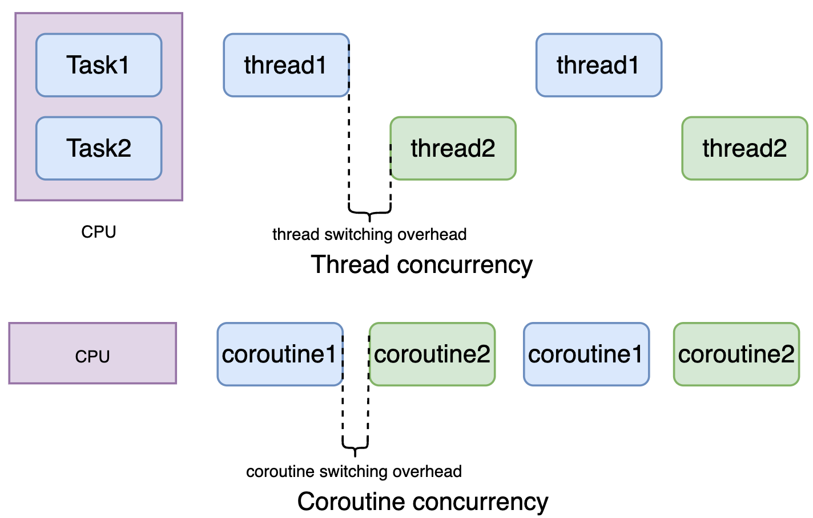

### Introduction
AysncIO in python has two keywords: async/await. Many people who first encounter async concept might wonder isn't that python can only have one thread in execution given the constraint of GIL? 

Indeed, ayncio is bound by GIL and it can't run more than one task at any moment as is shown below. This means that if another thread needs to run, the ownership of the GIL must be passed from the current executing thread to the other thread. This is what is called preemptive concurrency. This kind of switching is expensive when there are lots of threads. 

The core concept in asyncio is coroutine. asyncio has its own concurrency synchronization through coroutine. It coordinates task switch with little cost. Simply put, python emulate concurrency in one thread through coroutine using event loop. 
<p align="center">
    
    <em>Thread and coroutine</em>
    <br>
</p>

Coroutine style synchronization still has its overhead, why we would bother switching tasks? The reason is behind the io part in asyncio. Think about that you have the following three tasks:
>- Task1: cooking rice takes 40 mins
>- Task2: washing clothes takes 30 mins
>- Task3: dish washing takes 30 mins

How much it would take a person to complete all these tasks. It won't take us 100 mins for all these tasks because we just need to kick things off and have machines done for us. On the contrary, the following tasks most likely will consume us 100 mins because we have to get involved attentively. 
>- Task1: watching tv 30 mins
>- Task2: jogging 30 mins
>- Task3: playing video games 40 mins

This example is just how illustrate where async ops help in Python -- only in IO-bound programs such as http requests, file I/O etc, but not in CPU-bound programs. Note that in reality, python won't allow us to coordinate the execution of each tasks. We can only pack tasks and send them for async execution. 

```python
import asyncio
import time


async def async_task():
    now = time.time()
    await asyncio.sleep(1)
    print("Doing async tasks")
    await asyncio.sleep(1)
    print(time.time() - now)


def sync_task():
    now = time.time()
    time.sleep(1)
    print("Doing async tasks")
    time.sleep(1)
    print(time.time() - now)


async def main():
    # 注意这里*号。gather自动将函数列表封装成了协程任务。
    await asyncio.gather(*[async_task() for _ in range(3)])

now = time.time()
# run 3 async_task() coroutine concurrently
asyncio.run(main())
print(f"Time elapsed for running 3 coroutine tasks: {time.time() - now}")


now = time.time()
# run 3 sync_task() coroutine concurrently
sync_task()
sync_task()
sync_task()
print(f"Time elapsed for running 3 sync tasks: {time.time() - now}")
```


## How Does it Work
Let's first have a more formal definition of the two keywords, async and await. From realpython:  

> - The syntax async def introduces either a native coroutine or an asynchronous generator. The expressions async with and async for are also valid.
> - The keyword await passes function control back to the event loop. (It suspends the execution of the surrounding coroutine.) If Python encounters an await f() expression in the scope of g(), this is how await tells the event loop, “Suspend execution of g() until whatever I’m waiting on—the result of f()—is returned. In the meantime, go let something else run.” Await can only appear with async functions. 

Example:
```python
async def g():
# Pause here and come back to g() when f() is ready
    r = await f()
    return r

```

The event loop is the coordinator of how the coroutine tasks are executed. It is something like a while True loop that monitors coroutines, taking feedback on what’s idle, and looking around for things that can be executed in the meantime. It is able to wake up an idle coroutine when whatever that coroutine is waiting on becomes available. By default, an async IO event loop runs in a single thread and on a single CPU core.

The entire management of the event loop can be implicitly handled by one function call:

```python
asyncio.run(main())  # Python 3.7+
```

### Create Tasks and Gather Tasks
Using `asyncio.create_task` method
After creating tasks, we use asyncio.wait to gather all the tasks. 

```python
import asyncio

async def func1(i):
    print(f"coroutine {i} starting execution")
    await asyncio.sleep(2)
    print(f"coroutine {i} completes!")


async def main():
    tasks = []
    for i in range(1, 5):
        tasks.append(asyncio.create_task(func1(i)))

    await asyncio.wait(tasks)

if __name__ == '__main__':
    asyncio.run(main())
```


To gather tasks, we can also using new `gather` method. Notice that gather doesn't have to use `create_task`. It can automatically package coroutine into a task. 

```python
import asyncio

async def func1(i):
    print(f"coroutine {i} starting execution")
    await asyncio.sleep(2)
    print(f"coroutine {i} completes!")


async def main():
    tasks = []
    for i in range(1, 5):
        tasks.append(asyncio.create_task(func1(i)))

    await asyncio.gather(*tasks)

if __name__ == '__main__':
    asyncio.run(main())
```


### Get Results

We can use wait to get results. 

```python
import asyncio

async def func1(i):
    print(f"coroutine {i} starting execution")
    await asyncio.sleep(2)
    print(f"coroutine {i} completes!")


async def main():
    tasks = []
    for i in range(1, 5):
        tasks.append(asyncio.create_task(func1(i)))

    # Get execution results
    done, pending = await asyncio.wait(tasks)
    for task in done:
        print(f"Execution results: {task.result()}")

if __name__ == '__main__':
    asyncio.run(main())
```


We can also use gather to get results. 

```python
import asyncio

async def func1(i):
    print(f"coroutine {i} starting execution")
    await asyncio.sleep(2)
    print(f"coroutine {i} completes!")


async def main():
    tasks = []
    for i in range(1, 5):
        tasks.append(asyncio.create_task(func1(i)))

    results = await asyncio.gather(*tasks)
    for result in results:
        print(f"Execution results: {result}")

if __name__ == '__main__':
    asyncio.run(main())
```

Difference between asyncio.gather() and asyncio.wait()
1. Task wrapping ability
asyncio.gather() can wrap regular coroutine functions into tasks automatically.
asyncio.wait() cannot do this—it only accepts a list of already wrapped tasks.

2. Return values
asyncio.gather() returns the actual results of coroutine execution.
asyncio.wait() returns a tuple: (1) The first element is a set of completed tasks. (2) The second element is a set of pending tasks.

3. Order of results
asyncio.gather() preserves the order of results based on the input coroutine list.
asyncio.wait() does not guarantee order—results come as tasks complete.


## Coroutine, Task and Future
Let's give some clarifications about the concepts. 
1. Future: similar to C++ std::future
In C++, std::future acts as a handle for an asynchronous result. The main thread assigns a carrier to a new thread and retrieves a future before continuing its execution.
Once the new thread completes, it sets the result on the carrier (e.g., std::promise in C++). The main thread can synchronize by waiting on the future and retrieving the result, even if the worker thread has already exited. In Python, the concurrent.futures module provides a similar Future concept.

2. Task: like a thread pool task
A task in asyncio is analogous to a task in a thread pool. It represents an asynchronous execution unit, like a function that will run and eventually complete, producing a result.

3. Coroutine: 
Unlike Future and Task, which are primarily used for inter-thread communication (ITC), coroutines are single-threaded. A coroutine can yield execution back to a scheduler, allowing it to manage multiple tasks efficiently. The scheduler saves the context (e.g., call stack, register values, OS signals). It chooses the next coroutine to run and restores the previous coroutine’s state when it resumes.

4. The role of async/await
async/await is used to hint the scheduler about coroutines that are waiting on I/O or other long-running operations. When an async function encounters an I/O-bound task, it yields control to allow other tasks to run in the meantime.


### References
1. https://realpython.com/async-io-python/3. 
2. https://www.roguelynn.com/words/asyncio-we-did-it-wrong/


<!-- https://www.zhihu.com/question/294188439 -->
<!-- https://zhuanlan.zhihu.com/p/373340063 -->