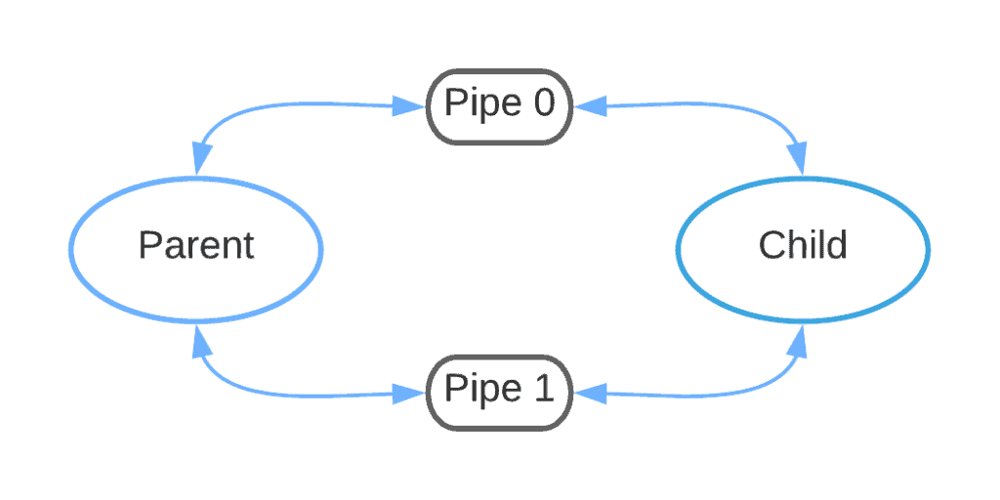
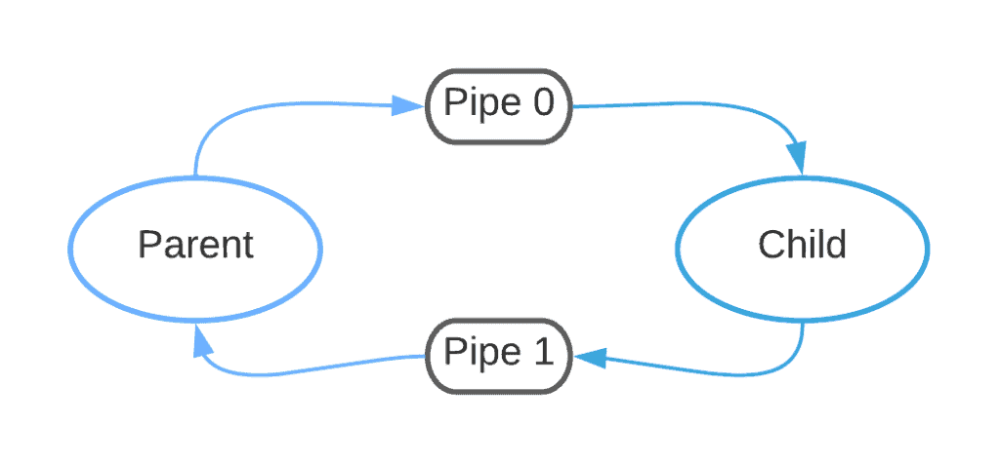
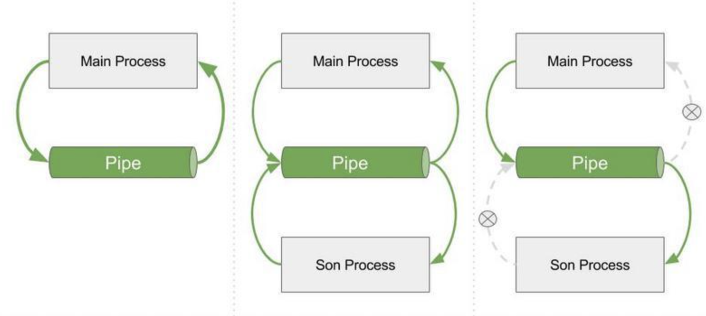

## 1\. Multiprocess Communication in Python

In multiprocessing, a pipe is a connection between two processes in Python. It is used to send data from one process which is received by another process. 

Under the covers, a pipe is implemented using a pair of connection objects, provided by the multiprocessing.connection.Connection class.

Creating a pipe will create two connection objects, one for sending data and one for receiving data. A pipe can also be configured to be duplex so that each connection object can both send and receive data.

The Pipe() function returns a pair of connection objects connected by a pipe which by default is duplex (two-way).


### 1.1 How Do Pipes Work?

**We always use a pipe with the system call _fork()_ that creates a new process.** As we guess, there is no point to use pipes when we have only one process. The figure below represents how we can have a two-way pipe between the parent and child process when we don’t close unnecessary file descriptors:

<!--  -->


**When we close the unused file descriptors we will have a figure like the below.** As we can see from the correct version in the figure below both the parent process and child process can read and write to pipes when we use _pipe_ and _fork_. **However, since the pipe is unidirectional we should be careful if we want the communicate unidirectionally.** That means both parent and child can send data to each other. In that case, one pipe wouldn’t work and that’s why we would need two pipes. One pipe for data flow from parent to child, and one pipe from data flow from child to parent. **We should also close the unneeded pipe descriptors:**

<!--  -->


**As we’ve said pipes are a more suitable IPC method for related processes.** Because communication should be simple enough to use raw binary bytes. Actually, pipes that we use in a shell script are the best application of pipes. What they do is that they basically execute binary programs. **So, the limitation of pipe is obvious that we can apply it only to related processes and we can have one-to-one communication.**

For more advanced IPC, there are of course some other ways like [shared memory](https://www.baeldung.com/cs/inter-process-communication#1-shared-memory), [message queue](https://en.wikipedia.org/wiki/Message_queue), and sockets.

As is shown below, there are three steps to create a pipe:
Three steps to build a pipe. 
- Create a pipe 
- Fork process and pipe connection 
- Close not used connection 
<p align="center">
     
</p>

<!--  -->

Below is a small code snippet to show how pipe works. 

```python
from multiprocessing import Pipe, Process


def son_process(x, pipe):
    _out_pipe, _in_pipe = pipe

    # 关闭fork过来的输入端
    _in_pipe.close()
    while True:
        try:
            msg = _out_pipe.recv()
            print(msg)
        except EOFError:
            # 当out_pipe接受不到输出的时候且输入被关闭的时候，会抛出EORFError，可以捕获并且退出子进程
            break


if __name__ == '__main__':
    out_pipe, in_pipe = Pipe(True)
    son_p = Process(target=son_process, args=(100, (out_pipe, in_pipe)))
    son_p.start()

    # 等 pipe 被 fork 后，关闭主进程的输出端
    # 这样，创建的Pipe一端连接着主进程的输入，一端连接着子进程的输出口
    out_pipe.close()
    for x in range(1000):
        in_pipe.send(x)
    in_pipe.close()
    son_p.join()
    print("Main process is done")
```


## 2\. Sockets

**Sockets have a significant role in today’s internet.** The term socket is first coined in RFC 147 in 1971 when it was used in the ARPANET. It is a unique identification to or from which information is transmitted in the network. Today’s modern implementations of sockets come from the Berkeley sockets. Sockets are directly related to the operating systems and processes and we can understand this situation from the Berkeley sockets application programming interface (API) in the Berkeley Software Distribution (BSD) which originated from Unix OS.

The network protocol stack’s API establishes a connection for each socket generated by an application which is a socket descriptor. It is like a file descriptor in Unix-like operating systems. The process saves it for use with _read_ and _write_ operations on the channel.

### 2.1. How Do Sockets Work?

**A network socket is bound to a combination of a kind of network protocol to be used for transmissions.** This combination includes the host’s network address and a port number. Ports are numbered resources on the node that indicate a different sort of software structure. They identify the service types for processes and act as an externally accessible location component, allowing other hosts to connect to them. We can use network sockets to establish a permanent connection between two nodes or to engage connectionless and multicast communications.

**To sum up, with sockets we can establish a connection between processes that runs even on different machines.** The socket API supports _send_ and _recv_ operations that allow processes to share message buffers in and out of the kernel-level communication buffer.

The _socket_ call allows us to create a kernel-level socket buffer. Also, it associates any kernel-level processing that needs to be associated with the socket along with the actual message movement. As we’ve mentioned, when we use sockets to establish communication, it can happen between processes on different machines.

## 3\. Differences Between Pipes and Sockets

We’ve explained pipes and sockets and tried to give intuition about how they work. As we’ve seen, they have quite different roles when we try to establish a connection between processes. It really depends on the situation and the problem which one is more suitable to use. **However, we can underline some of the differences between them:**

-   While communication in pipes is uni-directional, in sockets communication, it is bidirectional.
-   In order to establish communication between processes with pipes, processes should be related to each other. They should have a relationship like a parent and a child process. However, we don’t have such a restriction for sockets.
-   The other important difference is that we can use pipes to connect processes on the same physical machine. On the other side, we use sockets to establish connections between processes on different physical machines. That’s why they are one of the fundamental concepts in network systems.
-   There isn’t any concept of packaging in pipes. Sockets can have packages through communication using IPv4 or IPv6. While sockets can divide the big size of data into smaller chunks and send it in that way, pipes aren’t able to do that.


## References
1. https://realpython.com/python-data-classes/
2. https://www.baeldung.com/cs/pipes-vs-sockets