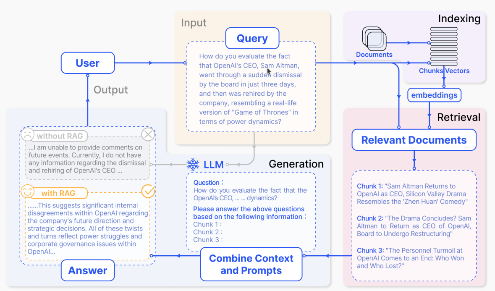
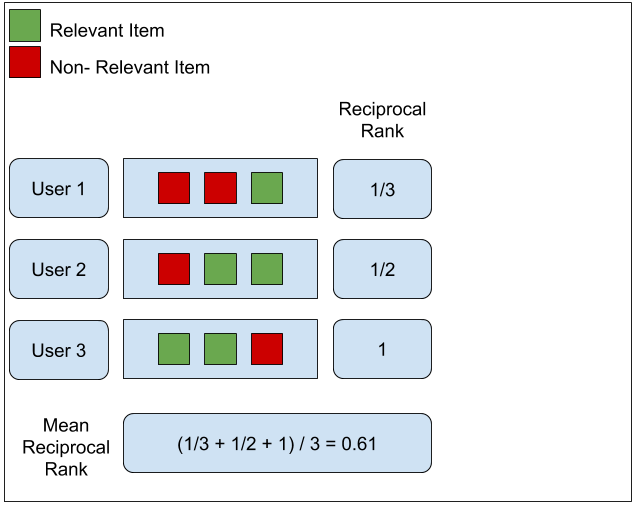
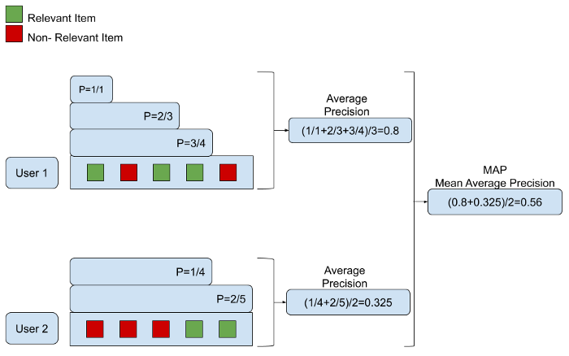
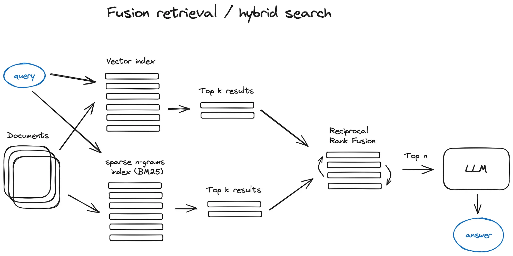

LLMs has made remarkable progress these days, however, they still exhibit notable limitations. Among these, hallucination is one of the most seen issues. In other words, the generations from LLMs are not grounded. To this end, people are turning to retrieval augmented generation to tackle the issue. In this blog, let’s roll up our sleeves and dive deep into the retrieval augmented system. 

RAG system contains: chunking, indexing, querying and generation. Chunking and indexing both are the offline processes which is the crucial data modeling phase. Querying and generation are online processes.

    
    RAG system for QA, image from [1]
     

### Indexing

### Retrieval
Retrieval is the online process where the system converts user query into vector representation and retrieve relevant documents. 

#### Retrieval Evaluation Metric
Like recommender system, retrieval system commonly use the following evaluation metrics.
- Hit ratio (hit@k), 
- Normalized Discounted Cumulative Gain (NDCG), 
- Precision@k, 
- Recall@k
- Mean Reciprocal Rank (MRR)
- Mean Average Precision (MAP)

##### Hit@k
Hit@k sometimes is also called Top-k accuracy. It is the percentage of search queries for each of which at least one item from the ground truth is returned within the top-k results. Simply put, it means % of queries get answer hit at top k retrieved passages. (Answer hit means user clicked on the doc). This number is meaningful when there are multiple test cases.

##### NDCG
Normalized Discounted Cumulative Gain (NDCG) is popular method for measuring the quality of a set of search results. It asserts the following:
- Very relevant results are more useful than somewhat relevant results which are more useful than irrelevant results (cumulative gain)
- Relevant results are more useful when they appear earlier in the set of results (discounting).
- The result of the ranking should be irrelevant to the query performed (normalization).
Cumulative Gain (CG) is the predecessor of DCG and does not include the position of a result in the consideration of the usefulness of a result set. In this way, it is the sum of the graded relevance values of all results in a search result list. Suppose you were presented with a set of search results for a query and asked to rank each result. 

Given a true relevance score $R_i$ (real value) for every item, there exist several ways to define a gain. One of the most popular is:
$$
G_i = 2^{R_i} - 1
$$

where $i$ is the rank position/index of the item. The relevance score can be defined by ourselves, for instance, we can say: 0 => Not relevant 1 => Near relevant 2 => Relevant. In practical use case, it's defined as a binary value 0 and 1 where 0 is irrelevant and 1 is there is relevance.

The cumulative gain is then defined as:
$$
CG@k = \sum_{i=1}^k G_i
$$

To achieve the Discounted cumulative gain (DCG) we must discount results that appear lower. The premise of DCG is that highly relevant documents appearing lower in a search result list should be penalized as the graded relevance value is reduced logarithmically proportional to the position of the result. Thus $DCG$ is:
$$
DCG@k = \sum_{i=1}^k\frac{2^{R_i} - 1}{log_2{(i + 1)}}
$$

As DCG either goes up with $k$ or it stays the same, the queries that return larger result sets will always have higher DCG scores than queries that return small result sets. To make comparison across queries fairer is we want to normalize the DCG score by the maximum possible DCG for different $k$.
$$
NDCG@k = \frac{DCG@k}{IDCG@k}
$$
where $IDCG@k$ is the best $DCG$ we can get at position $k$. 

##### Precision@k and Recall@k
Precision@k measures the percentage of relevant results among top k results. At the same time, recall@k evaluates the ratio of relevant results among top k to the total number of relevant items in the whole dataset.
$$
Precision@k = \frac{\text{number of recommended relevant items among top k}}{\text{number of recommended items k}}
$$
$$
Recall@k = \frac{\text{number of recommended relevant items among top k}}{\text{number of all relevant items in the system}}
$$

##### MRR
MRR measures “Where is the first relevant item?”. Given a query and a list of returned items, we find the rank (position $p_i$) of the first relevant items. We take the inverse of the rank to get the so-called reciprocal rank. For mean reciprocal rank, we just take average of reciprocal rank for all queries.

    
    MRR
     

MRR Pros

- This method is simple to compute and is easy to interpret.
- This method puts a high focus on the first relevant element of the list. It is best suited for targeted searches such as users asking for the “best item for me”.
- Good for known-item search such as navigational queries or looking for a fact.

MRR Cons
- The MRR metric does not evaluate the rest of the list of recommended items. It focuses on a single item from the list.
- It gives a list with a single relevant item just a much weight as a list with many relevant items. It is fine if that is the target of the evaluation.
- This might not be a good evaluation metric for users that want a list of related items to browse. The goal of the users might be to compare multiple related items.

##### MAP
The P@N decision support metric calculates the fraction of n recommendations that are good. The drawback of this metric is that it does not consider the recommended list as an ordered list. Precision@k considers the whole list as a set of items, and treats all the errors in the recommended list equally. The goal is to cut the error in the first few elements rather than much later in the list. For this, we need a metric that weights the errors accordingly. The goal is to weight heavily the errors at the top of the list. Then gradually decrease the significance of the errors as we go down the lower items in a list. The Average Prediction (AP) metric tries to approximate this weighting sliding scale. 

 Average Precision (AP) is a metric about how a single sorted prediction compares with the ground truth. i.e., AP tells how correct a single ranking of documents is, with respect to a single query. Thus, MAP is meaningful when there are multiple test cases.

AP is calculated as the average of precision@k over the list. 

    
    MAP
     

#### Retrieval Fusion
The straightforward idea in the era is dense retrieval is that we could combine sparse retrieval and dense retrieval together. A common approach is to use reciprocal rank fusion. The RRF score of document $d$ is:
$$
RRF_d = \sum_r^R{\frac{1}{c + r(d)}}
$$
assuming there are $R$ ranking items and $r(d)$ is the rank of document $d$. Here $c$ is a constant.

    
    RRF, image from [4]
     

### Generation

### References
[1] [Retrieval-Augmented Generation for Large Language Models: A Survey](https://arxiv.org/abs/2312.10997)  
[2] [Evaluation Metrics for Ranking problems: Introduction and Examples](https://queirozf.com/entries/evaluation-metrics-for-ranking-problems-introduction-and-examples)  
[3] [Reciprocal Rank Fusion outperforms Condorcet and individual Rank Learning Methods](https://plg.uwaterloo.ca/~gvcormac/cormacksigir09-rrf.pdf)  
[4] [Advanced RAG Techniques: an Illustrated Overview](https://pub.towardsai.net/advanced-rag-techniques-an-illustrated-overview-04d193d8fec6)

<!-- [x] Effective reformulation of query for code search using crowdsourced knowledge and extra-large data analystics. -->
<!-- https://towardsdatascience.com/comprehensive-guide-to-ranking-evaluation-metrics-7d10382c1025 -->

