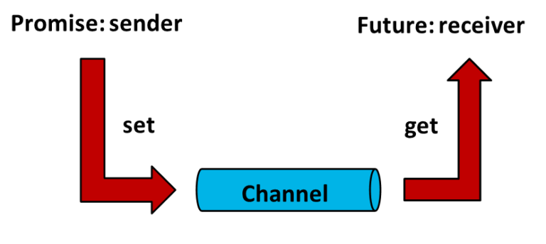
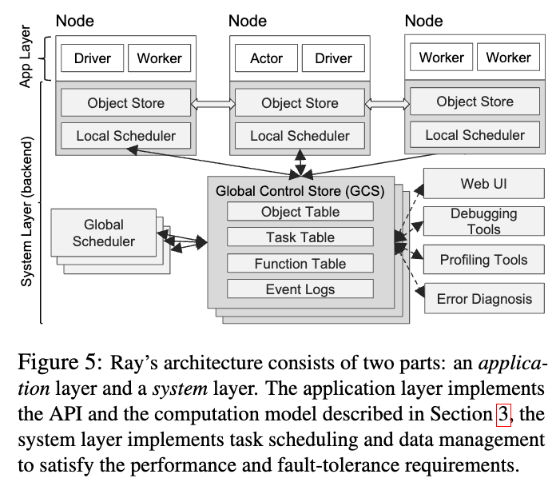
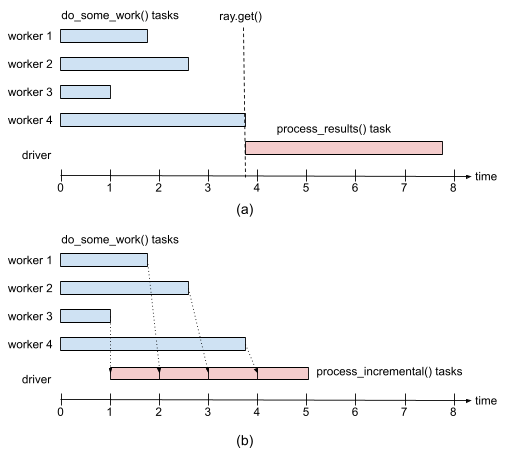

## Promise and Future
Before diving deep into Ray, I'll first give a brief introduction to the async ops in programming in C++.
 An asynchronous call delegates time-consuming or blocking tasks to other threads, thereby ensuring the current thread's responsiveness. Concretely, it involves the current thread delegating a task to another thread for execution. The current thread continues executing its own tasks without waiting for the delegated task's result. The result of the delegated task is only required at some point in the future when it is needed.

An asynchronous operation is created, executed by another thread, and upon completion, returns a result. The creator of the asynchronous call retrieves this result when needed. To meet these requirements, C++ provides std::future and std::promise. The relation is shown in the figure below. 
<p align="center">
    
    <em>Promise and future: worker gets the promise instance and main driver gets the future</em>
    <br>
</p>

When an asynchronous call is created, an instance of std::future is returned to the creator of the asynchronous call (receiver). Meanwhile, the executor of the asynchronous call (sender) holds an instance of std::promise. The executor uses std::promise to fulfill its promise (a commitment to deliver the result at a future point in time after the operation is completed), while the creator uses std::future to obtain this future value (the result corresponding to the promise fulfilled in the future). The std::promise instance held by the executor and the std::future instance held by the creator are both connected to a shared object. This shared object establishes a communication channel for information synchronization between the creator and the executor of the asynchronous call, enabling both parties to exchange information about the execution status of the asynchronous operation through this channel.

The executor accesses this channel via its std::promise instance to write values into the channel. The creator uses its std::future instance to retrieve values from the channel. Once the executor completes the execution of the asynchronous operation, it writes the result of the operation into the channel via the std::promise instance. The creator then retrieves the result of the asynchronous operation through its std::future instance.


```C++
#include <iostream>
#include <thread>
#include <future>
#include <vector>
#include <numeric>
#include <chrono>

int main() {
    // 创建一个promise对象实例
    std::promise<int> _promise;
    // 从promise对象实例中获取对应的future对象实例
    std::future<int> _future = _promise.get_future();
    // 构建测试对象
    std::vector<int> test_data = {1, 2, 3, 4, 5, 6};
    // 创建一个任务，该任务对容器内的所有元素求和，求和完成之后通过promise来返回结果
    auto sum_of_data = [](const std::vector<int>& data, std::promise<int> prom) {
        int sum = std::accumulate(data.begin(), data.end(), 0);
        std::this_thread::sleep_for(std::chrono::milliseconds(500)); // 休眠500ms
        prom.set_value(sum); // 完成承诺，将结果写入通道中
    };
    // 将这个任务交给一个线程，进行异步执行
    std::thread work_thread(sum_of_data, test_data, std::move(_promise));
    // 通过future的方法来获取异步调用的结果
    std::cout << "async result is " << _future.get() << std::endl;
    // 等待work_thread退出销毁完成
    work_thread.join();
    return 0;
}

// output
// async result is 21
```

## Introduction
Ray was designed with training RL system in mind. There are three kinds of tasks in RL system training
- Simulation where agents interact with environments and environments omit responses
- Evaluation where agents generate rollout trajectory
- Training where policy is updated for improvement

To handle these heterogenous tasks, Ray abstracts two kinds of computation:
- Stateless task: functions decorated with `@ray.remote` in python
- Stateful actor: classes decorated with `@ray.remote` in python

Below is one example of task computation in Ray. 
```python

# Ray task example

import ray
ray.init()

@ray.remote
def func(x):
    return x ** 2

# driver process
if __name__ == "__main__":

    # create 2 workers, execute func remotely, return 2 futures which each points to a remote op
    futures = [func.remote(i) for i in range(2)]

    # blocking
    results = ray.get(futures)) 
    print(f"The final result is: {results}") # [0, 1]
```


## Ray Actor
Declare an actor by annotating a class with @ray.remote, just like declaring a task from a function. Ray actor is different from python class in the following ways: 

> 1. Add accessor methods for any data members that you need to read or write, because using direct access, such as my_game.state, doesn't work for actors.
> 2. Construct actor instances with my_instance = MyClass.remote(...).
> 3. Call methods with my_instance.some_method.remote(...).
> 4. Use ray.get() and ray.wait() to retrieve results, just like you do for task results.

```python
import ray

@ray.remote
class Counter:
    def __init__(self):
        self.value = 0

    def increment(self):
        self.value += 1
        return self.value

    # define the accessor as we can't use direct access
    def get_counter(self):
        return self.value

# Create an actor from this class.
counter = Counter.remote()

# Call the actor.
obj_ref = counter.increment.remote()
print(ray.get(obj_ref))

# Create ten Counter actors.
counters = [Counter.remote() for _ in range(10)]

# Increment each Counter once and get the results. These tasks all happen in
# parallel.
results = ray.get([c.increment.remote() for c in counters])
print(results)

# Increment the first Counter five times. These tasks are executed serially
# and share state.
results = ray.get([counters[0].increment.remote() for _ in range(5)])
print(results)
```

### Ray Architecture
Ray is a general-purpose framework for parallel programming on a cluster. 
<p align="center">
    
    Ray Architecture
    <br>
</p>

## Ray Tips

### Delay ray.get()

With Ray, the invocation of every remote operation (e.g., task, actor method) is asynchronous. This means that the operation returns _immediately_ a promise/future, which is essentially an identifier (ID) of the operation’s result. This is key to achieve parallelism, as it allows the driver program to launch multiple operations in parallel. To get the actual results, the programmer needs to call ray.get() on the IDs of the results. This call blocks until the results are available. As a side effect, this operation also blocks the driver program from invoking other operations, which can hurt parallelism.


```python
import time

def do_some_work(x):
    time.sleep(1) # Replace this with work you need to do.
    return x

start = time.time()
results = [do_some_work(x) for x in range(4)]
print("duration =", time.time() - start, "\nresults = ", results)

# Above output, the program takes around 4 ses:
# duration = 4.0149290561676025 
# results =  [0, 1, 2, 3]


start = time.time()
results = [do_some_work.remote(x) for x in range(4)]
print("duration =", time.time() - start, "\nresults = ", results)

# Above output, 
# duration = 0.0003619194030761719 
# results =  [ObjectID(0100000000bdf683fc3e45db42685232b19d2a61), ObjectID(01000000da69c40e1c2f43b391443ce23de46cda), ObjectID(010000007fe0954ac2b3c0ab991538043e8f37e0), ObjectID(01000000cf47d5ecd1e26b42624454c795abe89b)]


start = time.time()
results = [ray.get(do_some_work.remote(x)) for x in range(4)]
print("duration =", time.time() - start, "\nresults = ", results)

# Above output, 
# duration = 4.018050909042358 
# results =  [0, 1, 2, 3]


results = ray.get([do_some_work.remote(x) for x in range(4)])
# output
# duration = 1.0064549446105957 
# results =  [0, 1, 2, 3]
```

Note that `ray.get()` is blocking, so calling it after each remote operation means that we wait for that operation to complete, which essentially means that we execute one operation at a time, hence no parallelism!
To enable parallelism, we need to call ray.get() _after_ invoking all tasks. We can easily do so in our example by replacing line “results = \[do\_some\_work.remote(x) for x in range(4)\]” with:


### Avoid passing same object repeatedly to remote tasks
When we pass a large object as an argument to a remote function, Ray calls ray.put() under the hood to store that object in the local object store. This can significantly improve the performance of a remote task invocation when the remote task is executed locally, as all local tasks share the object store. However, there are cases when automatically calling ray.put() on a task invocation leads to performance issues. One example is passing the same large object as an argument _repeatedly_, as illustrated by the program below:

```python
import time 
import numpy as np 
import ray 

ray.init(num_cpus = 4) 

@ray.remote 
def no_work(a): 
    return 

start = time.time() 
a = np.zeros((10000, 2000)) 
result_ids = [no_work.remote(a) for x in range(10)] 
results = ray.get(result_ids) 
print("duration =", time.time() - start) 
# output
# duration = 1.0699057579040527 
```


The right way is to put the shared object in the object store as shown below.
```python
import time 
import numpy as np 
import ray 

ray.init(num_cpus = 4) 

@ray.remote 
def no_work(a): 
    return 

start = time.time() 
a_id = ray.put(np.zeros((10000, 2000))) 
result_ids = [no_work.remote(a_id) for x in range(10)] 
results = ray.get(result_ids) 
print("duration =", time.time() - start) 
# output
# duration = 0.12425804138183594
```

### Pipeline data processing

If we use ray.get() on the results of multiple tasks we will have to wait until the _last_ one of these tasks finishes. This can be an issue if tasks take widely different amounts of time. To illustrate this issue, consider the following example where we run four do\_some\_work() tasks in parallel, with each task taking a time uniformly distributed between 0 and 4 sec. Next, assume the results of these tasks are processed by process\_results(), which takes 1 sec per result. The expected running time is then (1) the time it takes to execute the slowest of the do\_some\_work() tasks, plus (2) 4 sec which is the time it takes to execute process\_results().

```python
import time 
import random 
import ray 

ray.init(num_cpus = 4) 

@ray.remote 
def do_some_work(x): 
    time.sleep(random.uniform(0, 4)) # Replace this with work you need to do. 
    return x 

def process_results(results): 
    sum = 0 
    for x in results: 
        time.sleep(1) # Replace this with some processing code. 
        sum += x 
    return sum 

start = time.time() 
data_list = ray.get([do_some_work.remote(x) for x in range(4)]) 
sum = process_results(data_list) 
print("duration =", time.time() - start, "\nresult = ", sum) 
# output
# duration = 7.82636022567749
# result = 6
```
In order to process data as soon as it's available, we can use the pipeline to remove the waiting time. Ray allows us to do exactly this by calling ray.wait() on a list of object IDs. Without specifying any other parameters, this function returns as soon as an object in its argument list is ready. This call has two returns: (1) the ID of the ready object, and (2) the list containing the IDs of the objects not ready yet. The modified program is below.

```python
import time 
import random 
import ray 

ray.init(num_cpus = 4) 

@ray.remote 
def do_some_work(x): 
    time.sleep(random.uniform(0, 4)) # Replace this with work you need to do. 
    return x 

def process_incremental(sum, result): 
    time.sleep(1) # Replace this with some processing code. 
    return sum + result 

start = time.time() 
result_ids = [do_some_work.remote(x) for x in range(4)] 
sum = 0 
while len(result_ids): 
    done_id, result_ids = ray.wait(result_ids) 
    sum = process_incremental(sum, ray.get(done_id[0])) 
print("duration =", time.time() - start, "\nresult = ", sum) 

#output 
# duration = 4.852453231811523 
# result = 6 
```

<p align="center">
    
    Pipeline execution, image from 1
    <br>
</p>


A full example on how to use Ray for distributed neural network training

```python
import torch
import torch.nn as nn
from torch.utils.data import DataLoader
from torchvision import datasets
from torchvision.transforms import ToTensor

from ray import train
from ray.train.torch import TorchTrainer
from ray.train import ScalingConfig


def get_dataset():
    return datasets.FashionMNIST(
        root="/tmp/data",
        train=True,
        download=True,
        transform=ToTensor(),
    )


class NeuralNetwork(nn.Module):
    def __init__(self):
        super().__init__()
        self.flatten = nn.Flatten()
        self.linear_relu_stack = nn.Sequential(
            nn.Linear(28 * 28, 512),
            nn.ReLU(),
            nn.Linear(512, 512),
            nn.ReLU(),
            nn.Linear(512, 10),
        )

    def forward(self, inputs):
        inputs = self.flatten(inputs)
        logits = self.linear_relu_stack(inputs)
        return logits


# without distributed training, pure pytorch
def train_func():
    num_epochs = 3
    batch_size = 64

    dataset = get_dataset()
    dataloader = DataLoader(dataset, batch_size=batch_size)

    model = NeuralNetwork()

    criterion = nn.CrossEntropyLoss()
    optimizer = torch.optim.SGD(model.parameters(), lr=0.01)

    for epoch in range(num_epochs):
        for inputs, labels in dataloader:
            optimizer.zero_grad()
            pred = model(inputs)
            loss = criterion(pred, labels)
            loss.backward()
            optimizer.step()
        print(f"epoch: {epoch}, loss: {loss.item()}")


# train_func()


# distributed training
def train_func_distributed():
    num_epochs = 3
    batch_size = 64

    dataset = get_dataset()
    dataloader = DataLoader(dataset, batch_size=batch_size)
    dataloader = train.torch.prepare_data_loader(dataloader)

    model = NeuralNetwork()
    model = train.torch.prepare_model(model)

    criterion = nn.CrossEntropyLoss()
    optimizer = torch.optim.SGD(model.parameters(), lr=0.01)

    for epoch in range(num_epochs):
        for inputs, labels in dataloader:
            optimizer.zero_grad()
            pred = model(inputs)
            loss = criterion(pred, labels)
            loss.backward()
            optimizer.step()
        print(f"epoch: {epoch}, loss: {loss.item()}")


# For GPU Training, set `use_gpu` to True.
use_gpu = False

trainer = TorchTrainer(
    train_func_distributed,
    scaling_config=ScalingConfig(num_workers=4, use_gpu=use_gpu)
)

results = trainer.fit()
```

### References
<!-- 1. https://zhuanlan.zhihu.com/p/672327290 -->
<!-- 2. https://github.com/OpenRL-Lab/Ray_Tutorial/ -->
1. https://rise.cs.berkeley.edu/blog/ray-tips-for-first-time-users/
2. [Ray: A Distributed Framework for Emerging AI Applications](https://arxiv.org/abs/1712.05889)
3. https://github.com/dmatrix/ray-core-tutorial
4. [Ray Whitepaper](https://docs.google.com/document/d/1tBw9A4j62ruI5omIJbMxly-la5w4q_TjyJgJL_jN2fI/preview?tab=t.0#heading=h.iyrm5j2gcdoq)