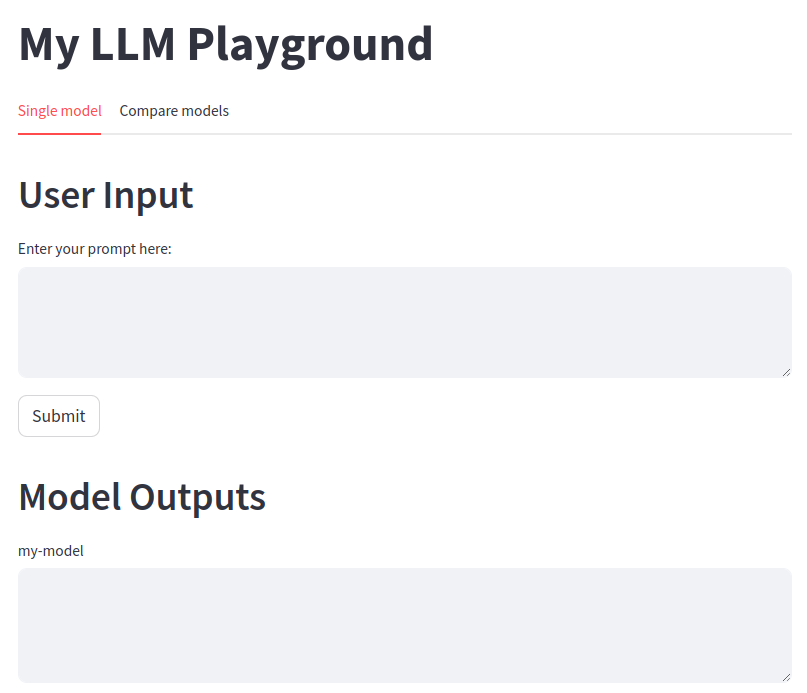

### LLM Serving


### Start the Server
Start the server, we can run 
```bash
ApiServicePort=8083 python3 serve.py
```
### Visualize
If we use flask `render_template` to provide the front end, then we can use the following to ways to launch the app,
```bash
# method 1
flask run

# method 2
python3 app.py
```

If we use `streamlit`, we can run with
```bash
streamlit run app.py
```
Usually we first star the serve and specific the port to listening on. Then pull up the front end page. 


The page will be like the following, simple and easy!!
<!--  -->
<p align="center">
    
    <br>
    <em>LLM Playground</em>
    <br>
</p>


### References
[1] [LiteLLM](https://github.com/BerriAI/litellm/) <br>
[2] [Openplayground](https://github.com/nat/openplayground) <br>