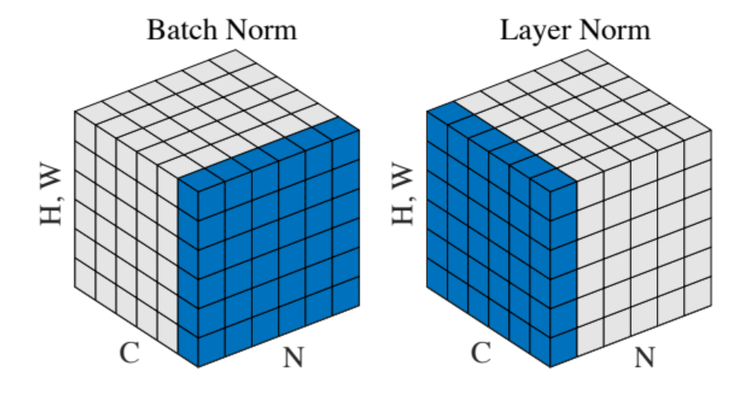

### LayerNorm vs BatchNorm

BatchNorm is commonly used in computer vision. LayerNorm is widely used in NLP. In CV, the channel dimension is RGB channel. In NLP, the channel dimension is feature dimin (embedding dim). 
Layer norm normalizes across feature dimension (such as embedding dim) for each of the inputs which removes the dependence on batches. This makes layer normalization well suited for sequence models such as transformers.
<p align="center">
     
    <em>Figure 1. batch norm vs layer norm</em>
    <br>
</p>

After understanding of the basics, we can write down the pseudo code as below
Pseudo code for batch norm
```python
for i in range(seq_len):
    for j in range(hidden_size):
        Norm([bert_tensor[k][i][j] for k in range(batch_size)])
```

Pseudo code for layer norm
```python
for i in range(batch_size):
    for j in range(seq_len):
        Norm([bert_tensor[i][j][k] for k in range(hidden_size)])
```

PyTorch implementation is shown blow. When using for BatchNorm, dim=0, assuming x is of the shape (batch_size, H, W, channel). When using for LayerNorm, dim=-1, assuming x is of shape (batch_size, seq_len, embed_dim). 
```python
class Norm(nn.Module):
    def __init__(self, num_features, variance_epsilon=1e-12):
        super(Norm, self).__init__()
        self.gamma = nn.Parameter(torch.ones(num_features))
        self.beta = nn.Parameter(torch.zeros(num_features))
        self.variance_epsilon = variance_epsilon

    def forward(self, x, dim):
        # layer norm, x is [bz, seq_len, dim], u is [bz, seq_len, 1], x_norm is the same shape with u
        u = x.mean(dim, keepdim=True)
        s = (x - u).pow(2).mean(dim, keepdim=True)
        x_norm = (x - u) / torch.sqrt(s + self.variance_epsilon)
        return self.gamma * x_norm + self.beta
```


### EMA in BN
Note that at inference time, there could be no batch dimension for batch norm. In practice, during training people will keep record of moving average of mean and variance. During inference time, these values will be used. The exponential moving average is calculated as follows
```
moving_mean = moving_mean * momentum + batch_mean * (1 - momentum)
moving_var = moving_var * momentum + batch_var * (1 - momentum)
```
The momentum is a hyperparameter which is generally chosen to be close to 1. A lower value of momentum means that older values are forgotten sooner. A more efficient way to calculate it is as follows:
```
moving_mean -= (moving_mean - batch_mean) * (1 - momentum)
moving_var -= (moving_var - batch_var) * (1 - momentum)
```
