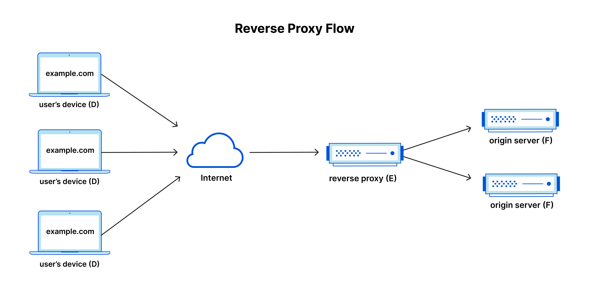

### Forward and Reverse Proxy Server
When clients (web browsers) make requests to sites and services on the Internet, the forward proxy server intercepts those requests and then communicates with servers on behalf of these clients like a middleman. 

Why we use forward proxy server?
- Circumvent restrictions. Sometimes restrictions through firewall are put on the access of the internet. A forward proxy can get around these restriction.
- Block contents. Proxies can be set up to block a certain type of user to access a specific type of online contents
- Protect online ID. 


A reverse proxy is an application that sits in front of back-end applications and forwards client (e.g. browser) requests to those applications. 

Why we use reverse proxy server?
- Load balancing
- Protection from attacks
- Caching (such as CDN caching)
- SSL encryption

A simplified way to sum it up would be to say that a forward proxy sits in front of a client and ensures that no origin server ever communicates directly with that specific client. On the other hand, a reverse proxy sits in front of an origin server and ensures that no client ever communicates directly with that origin server.

### Port Forwarding

Port forwarding or port mapping is a technique used in networking to redirect communication requests from one address and port number combination to another while the packets traverse a network gateway, such as a router or firewall. It is commonly used to allow external devices to access services on a private network, such as a home network, from the outside world.


Network Address Translation (NAT): Most routers use NAT to allow multiple devices on a local network to share a single public IP address. NAT changes the private IP addresses of devices on the local network to the public IP address of the router when sending data out to the internet.

Port Numbers: When data is sent over the internet, it is associated with a port number, which helps identify the specific service or application that data should be directed to. For example, HTTP traffic typically uses port 80, and HTTPS traffic uses port 443.

Port Forwarding Rule: When you set up port forwarding on a router, you create a rule that tells the router to forward traffic received on a specific port (or range of ports) to a specific internal IP address and port on the local network. This allows external devices to access a service on a device within the private network.


### Home Network Debugging

I have a MBP, but somehow the internet speed is very slow. When I use iphone the speed could be 300M+, however, while I use MBP, it's like 30M+. I did some research, the following command helped me. 
```bash
ifconfig awdl0 down
```

Turning off bluetooth might help. But from my experience, it's not that much. 


## References
1. https://www.speedtest.net/
2. https://www.reddit.com/r/macbookpro/comments/rtyjbt/finally_solved_my_slow_wifi_speeds_on_my_2021/